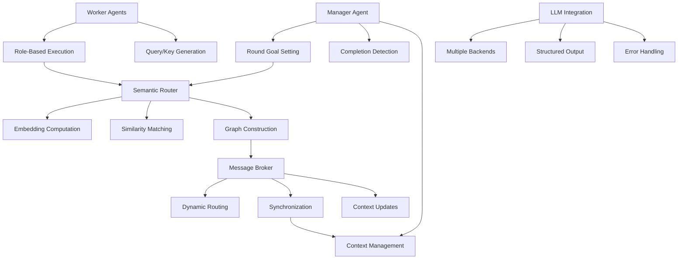

> This document is descriptive and non-normative.
> It does not define required Noematics behavior.

## Project Overview

### Objective
Implement a production-ready Noematics framework that enables dynamic semantic routing between multiple LLM agents for improved multi-round reasoning tasks.

### Key Features
- Dynamic communication graph construction via semantic matching
- Manager-guided orchestration with adaptive round goals
- Role-based agent specialization (code generation, mathematical reasoning)
- Interpretable coordination traces and visualization
- Model-agnostic LLM integration

---

## Technical Architecture

### Core Components

### Data Flow

1. **Initialization**: Manager sets initial task context
2. **Round Loop**:
   - Manager generates round goal
   - Workers execute with query/key descriptors
   - Semantic router builds communication graph
   - Message broker routes along edges
   - Context updated for next round
3. **Termination**: Manager detects completion and aggregates results
