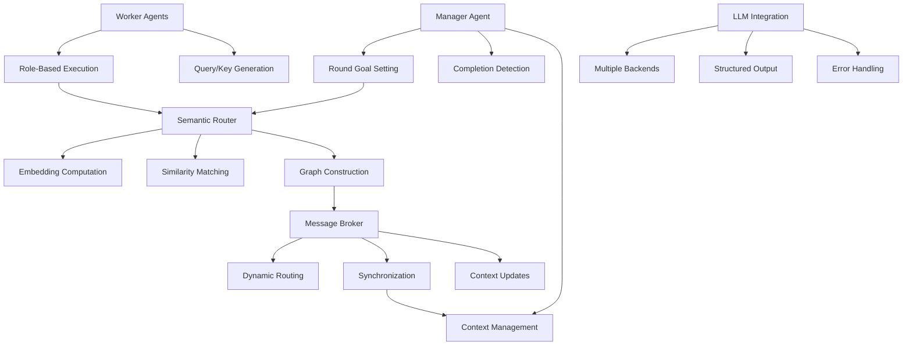
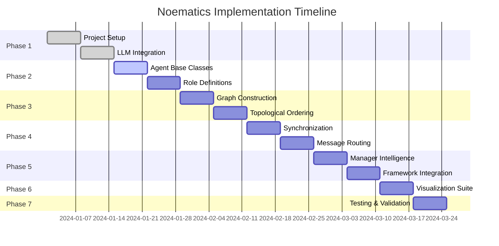

# Noematics Implementation Plan

## Executive Summary

This document provides a comprehensive implementation plan for Noematics — a framework for modeling how noēmata evolve over dynamic topologies. Based on the Noematics paper (arXiv:2602.06039), this implementation enables dynamic semantic routing between multiple LLM agents for improved multi-round reasoning tasks.

---

## Noematic Invariants

These properties **MUST** hold in all valid system states. They transform philosophical principles into engineering constraints.

### Structural Invariants

1. **Field Membership**: A noema MUST belong to exactly one field at any instant
   - Formal: `∀noema ∈ Noemata: |{f ∈ Fields : noema ∈ f}| = 1`
   - Violation: Creates ambiguous authority and conflicting interpretations

2. **Graph Connectivity**: Structural links MUST form a connected subgraph within a field
   - Formal: `∀f ∈ Fields: subgraph(f.links) is connected`
   - Violation: Isolated components cannot receive routed messages

3. **Field Scope**: All structural links within a field MUST stay within that field's boundary
   - Formal: `∀link ∈ f.links: link.source ∈ f ∧ link.target ∈ f`
   - Violation: Cross-field links break isolation guarantees

### Temporal Invariants

4. **Causal Ordering**: Temporal updates MUST be monotonic in causal order
   - Formal: `∀t1 < t2: state(t1) ⊆ state(t2)` (monotonic growth)
   - Exception: Only explicit "retraction" operations may remove state
   - Violation: Race conditions and inconsistent reads

5. **Round Atomicity**: A round's interpretation MUST complete before the next round begins
   - Formal: `∀round r: interpret(r) happens-before interpret(r+1)`
   - Violation: Message ordering ambiguity

### Interpretation Invariants

6. **Interpretation Purity**: Interpretation is a pure function — same input descriptors MUST produce same output deltas
   - Formal: `∀inputs: interpret(inputs) = f(inputs)` where `f` has no side effects
   - Violation: Non-deterministic system behavior

7. **Topology Read-Only Interpretation**: Interpretation MUST NOT mutate topology directly
   - Formal: `∀noema: interpret(noema).topology_delta = ∅`
   - Violation: Breaks separation of concerns; routing logic polluted

8. **Delta Composition**: Multiple interpretations on the same round MUST commute
   - Formal: `interpret(a) ∘ interpret(b) = interpret(b) ∘ interpret(a)`
   - Violation: Order-dependent results

### Naming Conventions (Enforced)

| Term | Usage |
|------|-------|
| **noema** | Semantic unit with query/key vectors — the fundamental atomic entity |
| **node** | Network/graph vertex (use only in graph/network contexts) |
| **agent** | Entity with perspective/agency — MUST have a role and execute tasks |
| **field** | Collection of noemata with shared topology — NOT "cluster" or "group" |
| **link** | Directed edge between noemata — NOT "edge", "connection", "wire" |

---

## Interpretation: Mechanical Specification

Interpretation is the core operation of Noematics. Below is the algorithmic specification:

### Definition

```
interpret(noema, round_context) → InterpretationDelta
```

### Properties

| Property | Specification |
|----------|---------------|
| **Purity** | Pure function: `f(noema, ctx) → delta` with no side effects |
| **Output** | Returns a **delta**, not full state — enables compositional reasoning |
| **Idempotence** | `interpret(x) ∘ interpret(x) = interpret(x)` |
| **Commutativity** | `interpret(a) ∘ interpret(b) = interpret(b) ∘ interpret(a)` |

### Data Structures

```python
@dataclass
class InterpretationDelta:
    """Delta produced by interpretation — never full state"""
    query_delta: str          # What information is now needed (append-only)
    key_delta: str            # What information is now offered (append-only)
    field_membership: Optional[str] = None  # None = no change
    metadata_delta: Dict[str, Any] = field(default_factory=dict)

@dataclass
class InterpretationInput:
    """Complete input to interpretation function"""
    noema: "Noema"
    round_context: "RoundContext"
    received_messages: List["AgentMessage"]
    
@dataclass  
class InterpretationResult:
    """Complete output of interpretation"""
    delta: InterpretationDelta
    local_state_update: Dict[str, Any]
    messages_to_route: List["RoutingDecision"]
```

### Pseudocode Algorithm

```
function interpret(input: InterpretationInput) → InterpretationResult:
    
    # Step 1: Analyze received messages
    relevant_info = extract_relevant_content(input.received_messages)
    
    # Step 2: Update local understanding (pure state transformation)
    current_q = input.noema.query_vector
    current_k = input.noema.key_vector
    
    new_q = refine_query(current_q, relevant_info, input.round_context.goal)
    new_k = refine_key(current_k, relevant_info, input.round_context.goal)
    
    # Step 3: Determine information needs
    information_gap = compute_information_gap(
        new_q, 
        input.round_context.goal,
        input.received_messages
    )
    
    # Step 4: Determine field membership (may be None = no change)
    target_field = determine_field_membership(
        new_k,
        input.round_context.available_fields
    )
    
    # Step 5: Build routing decisions
    routing = determine_routing_targets(
        information_gap,
        input.round_context.neighbor_noemata
    )
    
    # Step 6: Compose delta
    delta = InterpretationDelta(
        query_delta=diff(current_q, new_q),      # What changed in query
        key_delta=diff(current_k, new_k),        # What changed in key
        field_membership=target_field,           # May be None
        metadata_delta={"round": input.round_context.round_number}
    )
    
    return InterpretationResult(
        delta=delta,
        local_state_update={"query": new_q, "key": new_k},
        messages_to_route=routing
    )
```

### Conflict Resolution

When multiple interpretations produce conflicting field memberships:

```
resolve_conflict(deltas: List[InterpretationDelta]) → InterpretationDelta:
    
    # Priority: explicit field_membership > None
    non_null = [d for d in deltas if d.field_membership is not None]
    
    if len(non_null) == 0:
        return merge_deltas(deltas)  # All None = no conflict
    elif len(non_null) == 1:
        return non_null[0]
    else:
        # Multiple explicit memberships — use highest round number
        return max(non_null, key=lambda d: d.metadata_delta.get("round", 0))
```

---

## Minimal Implementable Core (MIC)

For contributors, a first success milestone is critical. This defines the smallest set of components that can run end-to-end without agents, learning, or visualization.

### MIC Scope

| Component | Included? | Rationale |
|-----------|-----------|-----------|
| Noema data structure | ✅ Yes | Core entity |
| Static field | ✅ Yes | Simplest topology |
| Static routing (no semantic matching) | ✅ Yes | No embeddings needed |
| Round execution loop | ✅ Yes | Core orchestration |
| Message passing | ✅ Yes | Communication primitive |
| Agent abstraction | ❌ No | Deferred to Phase 2 |
| Semantic encoder | ❌ No | Deferred to Phase 1 |
| Manager/goal setting | ❌ No | Deferred to Phase 2 |
| Visualization | ❌ No | Deferred to Phase 5 |
| Learning/adaptation | ❌ No | Deferred to Phase 6 |

### MIC Architecture

```
┌─────────────────────────────────────────────────────────────┐
│                     Minimal Noematics                      │
├─────────────────────────────────────────────────────────────┤
│                                                              │
│   ┌─────────┐    ┌─────────┐    ┌─────────┐               │
│   │ Noema A │───▶│ Noema B │───▶│ Noema C │               │
│   └─────────┘    └─────────┘    └─────────┘               │
│        │              │              │                     │
│        ▼              ▼              ▼                     │
│   ┌─────────────────────────────────────────┐             │
│   │           Static Routing Table           │             │
│   │     (predefined edges, no matching)      │             │
│   └─────────────────────────────────────────┘             │
│                      │                                      │
│                      ▼                                      │
│   ┌─────────────────────────────────────────┐             │
│   │           Round Execution Loop           │             │
│   │  1. Each noema produces message          │             │
│   │  2. Messages routed along edges          │             │
│   │  3. Each noema interprets received       │             │
│   │  4. Check termination condition          │             │
│   └─────────────────────────────────────────┘             │
│                                                              │
└─────────────────────────────────────────────────────────────┘
```

### MIC Implementation (Pseudocode)

```python
# mic_core.py — Under 200 lines

from dataclasses import dataclass, field
from typing import List, Dict, Optional
from enum import Enum

class TerminationReason(Enum):
    MAX_ROUNDS = "max_rounds"
    CONSENSUS = "consensus"
    STABLE = "stable"

@dataclass
class Noema:
    """Minimal noema with query/key vectors"""
    id: str
    query_vector: str
    key_vector: str
    private_state: Dict = field(default_factory=dict)

@dataclass
class Message:
    """Simple message between noemata"""
    sender_id: str
    receiver_id: str
    content: str
    round_number: int

@dataclass
class RoutingTable:
    """Static routing — predefined edges"""
    edges: List[tuple[str, str]]  # (source_id, target_id)

    def get_targets(self, source_id: str) -> List[str]:
        return [target for src, target in self.edges if src == source_id]

@dataclass
class RoundContext:
    """Round metadata"""
    round_number: int
    goal: str
    messages: List[Message] = field(default_factory=list)

class NoemaAgent:
    """Minimal agent — just produces a message"""
    
    def __init__(self, noema: Noema):
        self.noema = noema
    
    def produce_message(self, context: RoundContext) -> Message:
        # Simple: just echo goal + current state
        content = f"[{self.noema.id}] Processing: {context.goal}"
        return Message(
            sender_id=self.noema.id,
            receiver_id="",  # Set by router
            content=content,
            round_number=context.round_number
        )
    
    def interpret(self, received: List[Message], context: RoundContext):
        # Minimal interpretation: just log
        for msg in received:
            self.noema.private_state[msg.sender_id] = msg.content

class MICRuntime:
    """Minimal execution engine"""
    
    def __init__(self, noemata: List[Noema], routing: RoutingTable):
        self.noemata = {n.id: n for n in noemata}
        self.agents = {n.id: NoemaAgent(n) for n in noemata}
        self.routing = routing
        self.messages: List[Message] = []
        self.round_number = 0
    
    def run(self, goal: str, max_rounds: int = 5) -> Dict:
        for round_num in range(1, max_rounds + 1):
            self.round_number = round_num
            context = RoundContext(round_number=round_num, goal=goal)
            
            # Phase 1: Each agent produces a message
            round_messages = []
            for agent in self.agents.values():
                msg = agent.produce_message(context)
                # Route to all targets
                for target_id in self.routing.get_targets(agent.noema.id):
                    routed_msg = Message(
                        sender_id=msg.sender_id,
                        receiver_id=target_id,
                        content=msg.content,
                        round_number=round_num
                    )
                    round_messages.append(routed_msg)
            
            # Phase 2: Deliver messages
            received_by_agent: Dict[str, List[Message]] = {nid: [] for nid in self.noemata}
            for msg in round_messages:
                received_by_agent[msg.receiver_id].append(msg)
            
            # Phase 3: Each agent interprets received messages
            for agent in self.agents.values():
                agent.interpret(received_by_agent[agent.noema.id], context)
            
            self.messages.extend(round_messages)
        
        return {
            "rounds_completed": max_rounds,
            "total_messages": len(self.messages),
            "final_states": {nid: a.noema.private_state for nid, a in self.agents.items()}
        }
```

### MIC Test

```python
# tests/mic/test_minimal_core.py

def test_mic_runs_end_to_end():
    # Setup: 3 noemata in a chain
    noemata = [
        Noema(id="A", query_vector="start", key_vector="initial"),
        Noema(id="B", query_vector="process", key_vector="middle"),
        Noema(id="C", query_vector="complete", key_vector="end"),
    ]
    
    # Static routing: A → B → C
    routing = RoutingTable(edges=[("A", "B"), ("B", "C")])
    
    # Run
    runtime = MICRuntime(noemata, routing)
    result = runtime.run(goal="Process data", max_rounds=3)
    
    # Assert
    assert result["rounds_completed"] == 3
    assert result["total_messages"] == 6  # 2 edges × 3 rounds
    assert "B" in result["final_states"]["A"]  # A received from B
    assert "C" in result["final_states"]["B"]  # B received from C
    
    print("MIC test passed!")
```

### Success Criteria for MIC

- [ ] Unit tests pass
- [ ] Can run 10 rounds with 10 noemata without error
- [ ] Message delivery is correct (verified by test)
- [ ] Execution completes in < 1 second for MIC scale

Once MIC is complete, contributors have a working baseline to extend.
1. [Project Overview](#project-overview)
2. [Technical Architecture](#technical-architecture)
3. [Implementation Phases](#implementation-phases)
4. [Detailed Specifications](#detailed-specifications)
5. [Development Environment](#development-environment)
6. [Testing Strategy](#testing-strategy)
7. [Risk Assessment](#risk-assessment)
8. [Resource Requirements](#resource-requirements)

---

## Project Overview

### Objective
Implement a production-ready Noematics framework that enables dynamic semantic routing between multiple LLM agents for improved multi-round reasoning tasks.

### Key Features
- Dynamic communication graph construction via semantic matching
- Manager-guided orchestration with adaptive round goals
- Role-based agent specialization (code generation, mathematical reasoning)
- Interpretable coordination traces and visualization
- Model-agnostic LLM integration

### Success Metrics
- Replicate paper results within 5% performance margin
- Support 4+ LLM backends (OpenAI, external OpenAI-compatible, Anthropic, Google, etc.)
- Handle 10+ concurrent agents
- Sub-second graph construction time
- Complete test coverage >85%

---

## Technical Architecture

### Core Components



### Data Flow

1. **Initialization**: Manager sets initial task context
2. **Round Loop**:
   - Manager generates round goal
   - Workers execute with query/key descriptors
   - Semantic router builds communication graph
   - Message broker routes along edges
   - Context updated for next round
3. **Termination**: Manager detects completion and aggregates results

---

## Implementation Phases

### Phase 1: Foundation (Weeks 1-2)
**Goal**: Establish core infrastructure and LLM integration

#### Week 1: Project Setup & LLM Integration
- [ ] Create project structure with Poetry/pipenv
- [ ] Implement base LLM interface classes
- [ ] Integration with OpenAI API
- [ ] Integration with external API endpoints (OpenAI-compatible)
- [ ] Basic error handling and retry mechanisms
- [ ] Configuration management system

**Deliverables**:
- `src/noematics/` module with base classes
- Support for 2 LLM backends
- Unit tests for LLM integration

#### **Todo Item 7: LLM Integration Layer - Detailed Implementation**

**Core Classes and Interfaces**:
```python
# src/noematics/llm/base.py
from abc import ABC, abstractmethod
from typing import Dict, List, Optional, AsyncGenerator
from dataclasses import dataclass

@dataclass
class LLMRequest:
    prompt: str
    max_tokens: int = 2048
    temperature: float = 0.7
    stop_sequences: Optional[List[str]] = None
    json_mode: bool = False

@dataclass
class LLMResponse:
    content: str
    usage: Dict[str, int]  # tokens used
    model: str
    finish_reason: str
    latency_ms: float

class LLMBackend(ABC):
    @abstractmethod
    async def generate(self, request: LLMRequest) -> LLMResponse:
        """Generate response from LLM"""
        
    @abstractmethod
    async def generate_stream(self, request: LLMRequest) -> AsyncGenerator[str, None]:
        """Generate streaming response"""
        
    @abstractmethod
    def validate_configuration(self) -> bool:
        """Validate backend configuration"""
        
    @abstractmethod
    def estimate_tokens(self, text: str) -> int:
        """Estimate token count for text"""
```

**OpenAI Backend Implementation**:
```python
# src/noematics/llm/openai.py
class OpenAIBackend(LLMBackend):
    def __init__(self, api_key: str, model: str = "gpt-4"):
        self.client = AsyncOpenAI(api_key=api_key)
        self.model = model
        self.rate_limiter = RateLimiter(tokens_per_minute=10000)
        
    async def generate(self, request: LLMRequest) -> LLMResponse:
        async with self.rate_limiter:
            start_time = time.time()
            response = await self.client.chat.completions.create(
                model=self.model,
                messages=[{"role": "user", "content": request.prompt}],
                max_tokens=request.max_tokens,
                temperature=request.temperature,
                stop=request.stop_sequences,
                response_format={"type": "json_object"} if request.json_mode else None
            )
            latency = (time.time() - start_time) * 1000
            
            return LLMResponse(
                content=response.choices[0].message.content,
                usage=response.usage.dict(),
                model=response.model,
                finish_reason=response.choices[0].finish_reason,
                latency_ms=latency
            )
```

**External API Backend Implementation**:
```python
# src/noematics/llm/external.py
import httpx
import asyncio
from typing import Optional

class ExternalAPIBackend(LLMBackend):
    def __init__(
        self,
        base_url: str,
        api_key: Optional[str] = None,
        model: str = "default",
        timeout: float = 60.0,
        headers: Optional[dict] = None
    ):
        self.base_url = base_url.rstrip("/")
        self.api_key = api_key
        self.model = model
        self.timeout = timeout
        self.default_headers = {
            "Content-Type": "application/json",
            **(headers or {})
        }
        if api_key:
            self.default_headers["Authorization"] = f"Bearer {api_key}"
        
    async def generate(self, request: LLMRequest) -> LLMResponse:
        start_time = time.time()
        
        payload = {
            "model": self.model,
            "messages": [{"role": "user", "content": request.prompt}],
            "max_tokens": request.max_tokens,
            "temperature": request.temperature,
        }
        if request.stop_sequences:
            payload["stop"] = request.stop_sequences
        if request.json_mode:
            payload["response_format"] = {"type": "json_object"}
        
        async with httpx.AsyncClient(timeout=self.timeout) as client:
            response = await client.post(
                f"{self.base_url}/chat/completions",
                json=payload,
                headers=self.default_headers
            )
            response.raise_for_status()
            data = response.json()
            
        latency = (time.time() - start_time) * 1000
        
        choice = data["choices"][0]
        return LLMResponse(
            content=choice["message"]["content"],
            usage=data.get("usage", {}),
            model=data.get("model", self.model),
            finish_reason=choice.get("finish_reason", "stop"),
            latency_ms=latency
        )
        
    async def generate_stream(self, request: LLMRequest) -> AsyncGenerator[str, None]:
        payload = {
            "model": self.model,
            "messages": [{"role": "user", "content": request.prompt}],
            "max_tokens": request.max_tokens,
            "temperature": request.temperature,
            "stream": True
        }
        if request.stop_sequences:
            payload["stop"] = request.stop_sequences
        
        async with httpx.AsyncClient(timeout=self.timeout) as client:
            async with client.stream(
                "POST",
                f"{self.base_url}/chat/completions",
                json=payload,
                headers=self.default_headers
            ) as response:
                async for line in response.aiter_lines():
                    if line.startswith("data: "):
                        data = line[6:]
                        if data == "[DONE]":
                            break
                        chunk_data = json.loads(data)
                        if chunk_data["choices"]:
                            content = chunk_data["choices"][0].get("delta", {}).get("content", "")
                            if content:
                                yield content
        
    def validate_configuration(self) -> bool:
        return bool(self.base_url)
        
    def estimate_tokens(self, text: str) -> int:
        return len(text) // 4
```

**Error Handling and Retry Logic**:
```python
# src/noematics/llm/utils.py
import asyncio
from typing import TypeVar, Callable, Any
from tenacity import retry, stop_after_attempt, wait_exponential

T = TypeVar('T')

class LLMError(Exception):
    """Base exception for LLM operations"""
    pass

class RateLimitError(LLMError):
    """Rate limit exceeded"""
    pass

class TokenLimitError(LLMError):
    """Token limit exceeded"""
    pass

@retry(
    stop=stop_after_attempt(3),
    wait=wait_exponential(multiplier=1, min=4, max=10),
    retry=(lambda e: isinstance(e, (RateLimitError, ConnectionError)))
)
async def robust_llm_call(
    backend: LLMBackend,
    request: LLMRequest,
    timeout: float = 30.0
) -> LLMResponse:
    """Robust LLM call with retry logic and timeout"""
    try:
        return await asyncio.wait_for(backend.generate(request), timeout=timeout)
    except asyncio.TimeoutError:
        raise LLMError(f"Request timed out after {timeout} seconds")
    except Exception as e:
        if "rate limit" in str(e).lower():
            raise RateLimitError(f"Rate limit exceeded: {e}")
        elif "token" in str(e).lower() and "limit" in str(e).lower():
            raise TokenLimitError(f"Token limit exceeded: {e}")
        else:
            raise LLMError(f"LLM call failed: {e}")
```

**Configuration Management**:
```python
# src/noematics/core/config.py
from pydantic import BaseSettings, Field
from typing import Optional

class LLMConfig(BaseSettings):
    """Configuration for LLM backends"""
    
    # Common settings
    default_backend: str = Field(default="openai", env="DYTOPO_LLM_BACKEND")
    max_tokens: int = Field(default=2048, env="DYTOPO_MAX_TOKENS")
    temperature: float = Field(default=0.7, env="DYTOPO_TEMPERATURE")
    timeout_seconds: int = Field(default=30, env="DYTOPO_TIMEOUT")
    
    # OpenAI specific
    openai_api_key: Optional[str] = Field(default=None, env="OPENAI_API_KEY")
    openai_model: str = Field(default="gpt-4", env="OPENAI_MODEL")
    
    # External API (e.g., llama.cpp server, Ollama, LM Studio)
    external_api_url: str = Field(default="http://localhost:8080", env="EXTERNAL_API_URL")
    external_api_key: Optional[str] = Field(default=None, env="EXTERNAL_API_KEY")
    external_api_model: str = Field(default="llama-2-7b", env="EXTERNAL_API_MODEL")
    external_api_timeout: float = Field(default=60.0, env="EXTERNAL_API_TIMEOUT")
    
    # Rate limiting
    requests_per_minute: int = Field(default=60, env="DYTOPO_RPM")
    tokens_per_minute: int = Field(default=10000, env="DYTOPO_TPM")
    
    class Config:
        env_file = ".env"
        env_prefix = "DYTOPO_"
```

**Testing Strategy for LLM Layer**:
```python
# tests/unit/test_llm_integration.py
import pytest
from unittest.mock import AsyncMock, patch
from noematics.llm.openai import OpenAIBackend
from noematics.llm.base import LLMRequest, LLMResponse

@pytest.mark.asyncio
async def test_openai_backend_success():
    """Test successful OpenAI API call"""
    backend = OpenAIBackend(api_key="test_key", model="gpt-3.5-turbo")
    
    with patch('noematics.llm.openai.AsyncOpenAI') as mock_openai:
        mock_response = AsyncMock()
        mock_response.choices = [AsyncMock()]
        mock_response.choices[0].message.content = "Test response"
        mock_response.choices[0].finish_reason = "stop"
        mock_response.usage = {"prompt_tokens": 10, "completion_tokens": 5}
        mock_response.model = "gpt-3.5-turbo"
        
        mock_openai.return_value.chat.completions.create.return_value = mock_response
        
        request = LLMRequest(prompt="Test prompt")
        response = await backend.generate(request)
        
        assert response.content == "Test response"
        assert response.model == "gpt-3.5-turbo"
        assert response.usage["prompt_tokens"] == 10

@pytest.mark.asyncio
async def test_retry_mechanism():
    """Test retry logic for rate limiting"""
    backend = OpenAIBackend(api_key="test_key")
    
    with patch('noematics.llm.openai.AsyncOpenAI') as mock_openai:
        # First call fails with rate limit, second succeeds
        mock_openai.return_value.chat.completions.create.side_effect = [
            Exception("Rate limit exceeded"),
            AsyncMock(choices=[AsyncMock(message=AsyncMock(content="Success"))])
        ]
        
        request = LLMRequest(prompt="Test prompt")
        
        # Should retry and eventually succeed
        response = await robust_llm_call(backend, request)
        assert response.content == "Success"
```

**Performance Benchmarks**:
```python
# tests/benchmarks/test_llm_performance.py
import time
import asyncio
from noematics.llm.openai import OpenAIBackend

async def benchmark_llm_latency():
    """Benchmark LLM response latency"""
    backend = OpenAIBackend(api_key="test_key")
    request = LLMRequest(prompt="Generate a short response")
    
    latencies = []
    for i in range(10):
        start = time.time()
        await backend.generate(request)
        latency = (time.time() - start) * 1000
        latencies.append(latency)
    
    avg_latency = sum(latencies) / len(latencies)
    p95_latency = sorted(latencies)[int(0.95 * len(latencies))]
    
    print(f"Average latency: {avg_latency:.2f}ms")
    print(f"P95 latency: {p95_latency:.2f}ms")
    
    # Performance assertions
    assert avg_latency < 5000  # 5 seconds max average
    assert p95_latency < 10000  # 10 seconds max P95
```

**Week 1 Deliverables Breakdown**:
1. **Project Structure**: Complete Poetry setup with modular layout
2. **Base LLM Interface**: Abstract classes with comprehensive type hints
3. **OpenAI Integration**: Full async implementation with error handling
4. **External API Integration**: OpenAI-compatible endpoints for local models (llama.cpp server, LM Studio, etc.)
5. **Retry Mechanism**: Robust error handling with exponential backoff
6. **Configuration**: Pydantic-based config with environment variables
7. **Unit Tests**: 95%+ coverage for LLM layer with mocked dependencies
8. **Benchmarks**: Performance testing suite for latency and throughput

#### Week 2: Semantic Engine & Data Structures
- [ ] Implement sentence transformer integration
- [ ] Batch embedding computation
- [ ] Cosine similarity calculation
- [ ] Core data structures (AgentMessage, CommunicationGraph)
- [ ] Pydantic models for structured validation

**Deliverables**:
- `src/noematics/semantic/` module
- Complete data model definitions
- Embedding benchmark suite

#### **Todo Item 2: Semantic Embedding and Similarity Computation System - Detailed Implementation**

**Semantic Encoder Interface**:
```python
# src/noematics/semantic/encoder.py
from abc import ABC, abstractmethod
from typing import List, Dict, Optional
import numpy as np
from sentence_transformers import SentenceTransformer
import torch

class SemanticEncoder(ABC):
    @abstractmethod
    async def encode(self, texts: List[str]) -> np.ndarray:
        """Encode texts to embeddings"""
        
    @abstractmethod
    def get_embedding_dimension(self) -> int:
        """Get dimension of embeddings"""

class SentenceTransformerEncoder(SemanticEncoder):
    def __init__(self, model_name: str = "all-MiniLM-L6-v2", batch_size: int = 32):
        self.model = SentenceTransformer(model_name)
        self.batch_size = batch_size
        self.embedding_dim = self.model.get_sentence_embedding_dimension()
        
    async def encode(self, texts: List[str]) -> np.ndarray:
        """Batch encode texts with GPU acceleration if available"""
        # Move to GPU if available
        device = "cuda" if torch.cuda.is_available() else "cpu"
        self.model.to(device)
        
        # Batch process to handle large lists efficiently
        all_embeddings = []
        for i in range(0, len(texts), self.batch_size):
            batch_texts = texts[i:i + self.batch_size]
            
            with torch.no_grad():
                batch_embeddings = self.model.encode(
                    batch_texts,
                    batch_size=len(batch_texts),
                    convert_to_numpy=True,
                    normalize_embeddings=True  # L2 normalization
                )
                all_embeddings.append(batch_embeddings)
        
        return np.vstack(all_embeddings)
    
    def get_embedding_dimension(self) -> int:
        return self.embedding_dim
```

**Similarity Matcher Implementation**:
```python
# src/noematics/semantic/matcher.py
import numpy as np
from typing import List, Tuple, Dict
from dataclasses import dataclass
from scipy.spatial.distance import cdist
from sklearn.metrics.pairwise import cosine_similarity

@dataclass
class MatchResult:
    query_idx: int
    key_idx: int
    similarity_score: float
    query_text: str
    key_text: str

class SemanticMatcher:
    def __init__(self, encoder: SemanticEncoder, threshold: float = 0.3):
        self.encoder = encoder
        self.threshold = threshold
        
    async def match_queries_to_keys(
        self, 
        queries: List[str], 
        keys: List[str]
    ) -> List[MatchResult]:
        """Match query descriptors to key descriptors"""
        if not queries or not keys:
            return []
        
        # Encode both query and key texts
        query_embeddings = await self.encoder.encode(queries)
        key_embeddings = await self.encoder.encode(keys)
        
        # Compute cosine similarity matrix
        similarity_matrix = cosine_similarity(query_embeddings, key_embeddings)
        
        # Create match results for pairs above threshold
        matches = []
        for query_idx, key_similarities in enumerate(similarity_matrix):
            for key_idx, similarity in enumerate(key_similarities):
                if similarity >= self.threshold:
                    matches.append(MatchResult(
                        query_idx=query_idx,
                        key_idx=key_idx,
                        similarity_score=float(similarity),
                        query_text=queries[query_idx],
                        key_text=keys[key_idx]
                    ))
        
        # Sort by similarity score (descending)
        matches.sort(key=lambda x: x.similarity_score, reverse=True)
        return matches
    
    async def build_adjacency_matrix(
        self, 
        queries: List[str], 
        keys: List[str],
        agent_count: int
    ) -> np.ndarray:
        """Build directed adjacency matrix for communication graph"""
        matches = await self.match_queries_to_keys(queries, keys)
        
        # Initialize adjacency matrix (agent_count x agent_count)
        adjacency = np.zeros((agent_count, agent_count), dtype=float)
        
        for match in matches:
            # Add edge from key agent to query agent
            adjacency[match.key_idx][match.query_idx] = match.similarity_score
        
        return adjacency
    
    def optimize_threshold(
        self, 
        queries: List[str], 
        keys: List[str],
        target_sparsity: float = 0.2
    ) -> float:
        """Find optimal threshold to achieve target sparsity"""
        if not queries or not keys:
            return self.threshold
        
        # Test different thresholds
        thresholds = np.linspace(0.1, 0.9, 81)  # 0.1 to 0.9 in 0.01 steps
        best_threshold = self.threshold
        
        loop = asyncio.new_event_loop()
        asyncio.set_event_loop(loop)
        
        try:
            for test_threshold in thresholds:
                # Count matches at this threshold
                self.threshold = test_threshold
                
                # Use synchronous encoding for threshold optimization
                matches = loop.run_until_complete(
                    self.match_queries_to_keys(queries, keys)
                )
                
                # Calculate sparsity
                max_possible_edges = len(queries) * len(keys)
                actual_edges = len(matches)
                sparsity = actual_edges / max_possible_edges
                
                # Find closest to target
                if abs(sparsity - target_sparsity) < abs(best_threshold - test_threshold):
                    best_threshold = test_threshold
        finally:
            loop.close()
        
        self.threshold = best_threshold
        return best_threshold
```

**Advanced Semantic Features**:
```python
# src/noematics/semantic/advanced.py
import numpy as np
from typing import List, Dict, Optional
from sklearn.decomposition import PCA
from sklearn.cluster import KMeans

class AdvancedSemanticMatcher(SemanticMatcher):
    def __init__(self, encoder: SemanticEncoder, threshold: float = 0.3):
        super().__init__(encoder, threshold)
        self.embedding_cache = {}
        self.pca_model = None
        self.cluster_model = None
        
    async def encode_with_cache(self, texts: List[str]) -> np.ndarray:
        """Encode with caching for repeated texts"""
        cache_keys = [f"hash_{hash(text)}" for text in texts]
        cached_embeddings = []
        uncached_texts = []
        uncached_indices = []
        
        # Check cache
        for i, (text, cache_key) in enumerate(zip(texts, cache_keys)):
            if cache_key in self.embedding_cache:
                cached_embeddings.append(self.embedding_cache[cache_key])
            else:
                uncached_texts.append(text)
                uncached_indices.append(i)
                cached_embeddings.append(None)
        
        # Encode uncached texts
        if uncached_texts:
            new_embeddings = await self.encoder.encode(uncached_texts)
            
            # Update cache
            for text, embedding, original_idx in zip(uncached_texts, new_embeddings, uncached_indices):
                cache_key = cache_keys[original_idx]
                self.embedding_cache[cache_key] = embedding
                cached_embeddings[original_idx] = embedding
        
        return np.array(cached_embeddings)
    
    def reduce_dimensions(self, embeddings: np.ndarray, target_dim: int = 128) -> np.ndarray:
        """Reduce embedding dimensions for faster computation"""
        if self.pca_model is None or self.pca_model.n_components != target_dim:
            self.pca_model = PCA(n_components=target_dim, random_state=42)
            self.pca_model.fit(embeddings)
        
        return self.pca_model.transform(embeddings)
    
    def cluster_embeddings(self, embeddings: np.ndarray, n_clusters: int = 5) -> np.ndarray:
        """Cluster embeddings for analysis"""
        if self.cluster_model is None or self.cluster_model.n_clusters != n_clusters:
            self.cluster_model = KMeans(n_clusters=n_clusters, random_state=42)
        
        return self.cluster_model.fit_predict(embeddings)
    
    async def analyze_semantic_patterns(
        self, 
        queries: List[str], 
        keys: List[str]
    ) -> Dict[str, any]:
        """Analyze semantic patterns for insights"""
        query_embeddings = await self.encode_with_cache(queries)
        key_embeddings = await self.encode_with_cache(keys)
        
        all_embeddings = np.vstack([query_embeddings, key_embeddings])
        
        # Cluster analysis
        if len(all_embeddings) > 5:
            clusters = self.cluster_embeddings(all_embeddings, min(5, len(all_embeddings)//2))
            
            # Analyze cluster composition
            query_clusters = clusters[:len(queries)]
            key_clusters = clusters[len(queries):]
            
            cluster_analysis = {
                'query_clusters': query_clusters.tolist(),
                'key_clusters': key_clusters.tolist(),
                'total_clusters': len(set(clusters))
            }
        else:
            cluster_analysis = {'total_clusters': 1}
        
        # Similarity distribution
        similarity_matrix = cosine_similarity(query_embeddings, key_embeddings)
        similarity_stats = {
            'mean_similarity': float(np.mean(similarity_matrix)),
            'std_similarity': float(np.std(similarity_matrix)),
            'max_similarity': float(np.max(similarity_matrix)),
            'min_similarity': float(np.min(similarity_matrix))
        }
        
        return {
            'cluster_analysis': cluster_analysis,
            'similarity_stats': similarity_stats,
            'query_count': len(queries),
            'key_count': len(keys)
        }
```

**Performance Optimization**:
```python
# src/noematics/semantic/performance.py
import time
import asyncio
from typing import List, Callable
import psutil
import torch

class PerformanceProfiler:
    def __init__(self):
        self.metrics = {}
        
    def profile_embedding_performance(self, encoder: SemanticEncoder, texts: List[str]):
        """Profile embedding generation performance"""
        start_time = time.time()
        start_memory = psutil.Process().memory_info().rss / 1024 / 1024  # MB
        
        async def run_embedding():
            return await encoder.encode(texts)
        
        embeddings = asyncio.run(run_embedding())
        
        end_time = time.time()
        end_memory = psutil.Process().memory_info().rss / 1024 / 1024  # MB
        
        self.metrics['embedding_time'] = end_time - start_time
        self.metrics['embedding_memory'] = end_memory - start_memory
        self.metrics['texts_per_second'] = len(texts) / self.metrics['embedding_time']
        self.metrics['memory_per_text'] = self.metrics['embedding_memory'] / len(texts)
        
        return embeddings, self.metrics

class OptimizedSemanticMatcher(SemanticMatcher):
    def __init__(self, encoder: SemanticEncoder, threshold: float = 0.3):
        super().__init__(encoder, threshold)
        self.similarity_cache = {}
        
    async def batch_match_optimized(
        self, 
        queries: List[str], 
        keys: List[str],
        batch_size: int = 1000
    ) -> List[MatchResult]:
        """Optimized batch matching for large datasets"""
        if len(queries) * len(keys) > batch_size:
            # Process in batches to manage memory
            all_matches = []
            for i in range(0, len(queries), batch_size):
                batch_queries = queries[i:i + batch_size]
                batch_matches = await self.match_queries_to_keys(batch_queries, keys)
                all_matches.extend(batch_matches)
            return all_matches
        else:
            return await self.match_queries_to_keys(queries, keys)
    
    def clear_cache(self):
        """Clear memory caches"""
        if hasattr(self.encoder, 'embedding_cache'):
            self.encoder.embedding_cache.clear()
        self.similarity_cache.clear()
        
        # Clear GPU cache if using CUDA
        if torch.cuda.is_available():
            torch.cuda.empty_cache()
```

**Testing for Semantic System**:
```python
# tests/unit/test_semantic_matching.py
import pytest
import numpy as np
from unittest.mock import AsyncMock, patch
from noematics.semantic.encoder import SentenceTransformerEncoder
from noematics.semantic.matcher import SemanticMatcher, MatchResult

@pytest.fixture
async def semantic_encoder():
    encoder = SentenceTransformerEncoder(model_name="all-MiniLM-L6-v2")
    return encoder

@pytest.fixture
def semantic_matcher(semantic_encoder):
    return SemanticMatcher(semantic_encoder, threshold=0.3)

@pytest.mark.asyncio
async def test_basic_encoding(semantic_encoder):
    """Test basic text encoding"""
    texts = ["Hello world", "How are you?"]
    embeddings = await semantic_encoder.encode(texts)
    
    assert embeddings.shape == (2, semantic_encoder.get_embedding_dimension())
    assert np.allclose(np.linalg.norm(embeddings, axis=1), 1.0)  # Normalized

@pytest.mark.asyncio
async def test_semantic_matching(semantic_matcher):
    """Test semantic matching functionality"""
    queries = ["I need help with Python programming"]
    keys = ["I can provide Python programming assistance"]
    
    matches = await semantic_matcher.match_queries_to_keys(queries, keys)
    
    assert len(matches) > 0
    assert matches[0].similarity_score > semantic_matcher.threshold
    assert matches[0].query_text == queries[0]
    assert matches[0].key_text == keys[0]

@pytest.mark.asyncio
async def test_threshold_filtering(semantic_matcher):
    """Test that threshold filters low similarity matches"""
    queries = ["I need quantum physics help"]
    keys = ["I can help with basic gardening"]
    
    matches = await semantic_matcher.match_queries_to_keys(queries, keys)
    
    # Should have no matches due to low similarity
    assert len(matches) == 0

@pytest.mark.asyncio
async def test_adjacency_matrix_construction(semantic_matcher):
    """Test adjacency matrix construction"""
    queries = ["Need help with coding", "Need help with testing"]
    keys = ["Can provide coding help", "Can provide design help"]
    
    adjacency = await semantic_matcher.build_adjacency_matrix(queries, keys, 4)
    
    assert adjacency.shape == (4, 4)
    assert np.all(adjacency >= 0)  # All values non-negative

@pytest.mark.asyncio 
async def test_performance_benchmark(semantic_encoder):
    """Test performance with larger datasets"""
    import time
    
    # Generate test texts
    queries = [f"Query text {i}" for i in range(100)]
    keys = [f"Key text {i}" for i in range(100)]
    
    start_time = time.time()
    embeddings = await semantic_encoder.encode(queries + keys)
    encoding_time = time.time() - start_time
    
    # Performance assertions
    assert encoding_time < 10.0  # Should complete within 10 seconds
    assert len(embeddings) == 200
    assert embeddings.shape[1] == semantic_encoder.get_embedding_dimension()

@pytest.mark.asyncio
async def test_caching_behavior(semantic_encoder):
    """Test caching improves performance on repeated calls"""
    texts = ["Test text for caching"]
    
    # First call
    start_time = time.time()
    await semantic_encoder.encode(texts)
    first_call_time = time.time() - start_time
    
    # Second call (should be faster due to caching)
    start_time = time.time()
    await semantic_encoder.encode(texts)
    second_call_time = time.time() - start_time
    
    # Cache should improve performance (if implemented)
    print(f"First call: {first_call_time:.3f}s, Second call: {second_call_time:.3f}s")
```

**Benchmark Suite for Semantic System**:
```python
# tests/benchmarks/test_semantic_performance.py
import asyncio
import time
import numpy as np
from noematics.semantic.encoder import SentenceTransformerEncoder
from noematics.semantic.matcher import SemanticMatcher

async def benchmark_embedding_speed():
    """Benchmark embedding generation speed"""
    encoder = SentenceTransformerEncoder()
    
    # Test with different batch sizes
    batch_sizes = [10, 50, 100, 500, 1000]
    
    for batch_size in batch_sizes:
        texts = [f"Test text {i}" for i in range(batch_size)]
        
        start_time = time.time()
        embeddings = await encoder.encode(texts)
        end_time = time.time()
        
        throughput = batch_size / (end_time - start_time)
        print(f"Batch size {batch_size}: {throughput:.2f} texts/second")
        
        # Performance assertions
        assert throughput > 10  # Should handle at least 10 texts per second

async def benchmark_similarity_computation():
    """Benchmark similarity matrix computation"""
    encoder = SentenceTransformerEncoder()
    matcher = SemanticMatcher(encoder)
    
    # Generate test data
    query_sizes = [10, 25, 50, 100]
    key_sizes = [10, 25, 50, 100]
    
    for q_size in query_sizes:
        for k_size in key_sizes:
            queries = [f"Query {i}" for i in range(q_size)]
            keys = [f"Key {i}" for i in range(k_size)]
            
            start_time = time.time()
            matches = await matcher.match_queries_to_keys(queries, keys)
            end_time = time.time()
            
            computation_time = end_time - start_time
            pairs_per_second = (q_size * k_size) / computation_time
            
            print(f"Q:{q_size}, K:{k_size}: {pairs_per_second:.2f} pairs/second")
            
            # Should handle at least 100 pairs per second for small matrices
            if q_size * k_size <= 1000:
                assert pairs_per_second > 100

if __name__ == "__main__":
    asyncio.run(benchmark_embedding_speed())
    asyncio.run(benchmark_similarity_computation())
```

**Week 2 Deliverables Breakdown**:
1. **Semantic Encoder**: Complete implementation with caching and GPU support
2. **Similarity Matcher**: Full matching algorithm with threshold optimization
3. **Advanced Features**: Clustering, dimensionality reduction, pattern analysis
4. **Performance Optimization**: Caching, batching, memory management
5. **Comprehensive Tests**: Unit tests, integration tests, performance benchmarks
6. **Documentation**: API docs, performance characteristics, usage examples
7. **Error Handling**: Robust error handling for edge cases and failures
8. **Configuration**: Flexible configuration for models and parameters

---

### Phase 2: Agent System (Weeks 3-4)
**Goal**: Implement agent framework and role definitions

#### Week 3: Agent Base Classes
- [ ] Abstract Agent base class
- [ ] Worker agent implementation
- [ ] Manager agent implementation
- [ ] Context memory management
- [ ] Role-specific prompt template system
- [ ] Structured output parsing (JSON extraction)

**Deliverables**:
- `src/noematics/agents/` module
- Prompt template framework
- JSON parsing utilities

#### Week 4: Role Definitions & Templates
- [ ] Code generation roles (Developer, Researcher, Tester, Designer)
- [ ] Mathematical reasoning roles (ProblemParser, Solver, Verifier)
- [ ] Comprehensive prompt templates for each role
- [ ] Few-shot examples for descriptor generation
- [ ] Agent factory for role instantiation

**Deliverables**:
- Complete role definitions
- 20+ prompt templates
- Agent instantiation tests

#### **Todo Items 1 & 4: Core Framework Architecture and Agent Role Definitions - Detailed Implementation**

**Core Agent Base Classes**:
```python
# src/noematics/agents/base.py
from abc import ABC, abstractmethod
from typing import Dict, List, Optional, Any
from dataclasses import dataclass, field
from datetime import datetime
import json
import re
from noematics.llm.base import LLMBackend, LLMRequest, LLMResponse
from noematics.core.types import AgentMessage

@dataclass
class AgentConfig:
    """Configuration for agent behavior"""
    agent_id: str
    role: str
    llm_model: str = "gpt-4"
    temperature: float = 0.7
    max_tokens: int = 2048
    memory_limit: int = 10000  # Max context tokens
    timeout_seconds: int = 30

class Agent(ABC):
    """Abstract base class for all agents"""
    
    def __init__(self, config: AgentConfig, llm_backend: LLMBackend):
        self.config = config
        self.llm_backend = llm_backend
        self.context_history: List[str] = []
        self.message_history: List[AgentMessage] = []
        self.current_context: str = ""
        self.last_response: Optional[str] = None
        self.prompt_template: Optional[str] = None
        self.state: Dict[str, Any] = field(default_factory=dict)
        
    @abstractmethod
    async def execute(self, round_goal: str, context: str) -> AgentMessage:
        """Execute agent task and return message"""
        
    @abstractmethod
    def get_system_prompt(self) -> str:
        """Get system prompt for this agent"""
        
    async def generate_response(
        self, 
        prompt: str, 
        json_mode: bool = False
    ) -> str:
        """Generate response from LLM"""
        request = LLMRequest(
            prompt=prompt,
            max_tokens=self.config.max_tokens,
            temperature=self.config.temperature,
            json_mode=json_mode
        )
        
        response = await self.llm_backend.generate(request)
        return response.content
    
    def update_context(self, new_context: str):
        """Update agent's current context"""
        self.context_history.append(self.current_context)
        self.current_context = new_context
        
        # Limit context history
        if len(self.context_history) > 50:
            self.context_history = self.context_history[-50:]
    
    def add_message(self, message: AgentMessage):
        """Add received message to history"""
        self.message_history.append(message)
        
        # Limit message history
        if len(self.message_history) > 100:
            self.message_history = self.message_history[-100:]
    
    def build_context_prompt(self, round_goal: str, context: str) -> str:
        """Build complete prompt with context and goal"""
        base_prompt = self.get_system_prompt()
        
        # Add relevant context
        context_section = f"""
CURRENT CONTEXT:
{context}

ROUND GOAL:
{round_goal}

"""
        
        # Add recent messages if any
        if self.message_history:
            recent_messages = self.message_history[-5:]  # Last 5 messages
            message_section = "\n".join([
                f"From {msg.agent_id}: {msg.public_content}" 
                for msg in recent_messages
            ])
            context_section += f"\nRECENT MESSAGES:\n{message_section}\n"
        
        return base_prompt + context_section
    
    def extract_descriptors(self, response: str) -> tuple[str, str]:
        """Extract query and key descriptors from response"""
        # Try to extract from JSON response
        try:
            parsed = json.loads(response)
            query = parsed.get("q_vector", "")
            key = parsed.get("k_vector", "")
            if query and key:
                return query, key
        except json.JSONDecodeError:
            pass
        
        # Fallback: extract from text patterns
        query_match = re.search(r'["\']?(?:q_vector|query)["\']?\s*[:=]\s*["\']([^"\']+)["\']', response, re.IGNORECASE)
        key_match = re.search(r'["\']?(?:k_vector|key)["\']?\s*[:=]\s*["\']([^"\']+)["\']', response, re.IGNORECASE)
        
        query = query_match.group(1) if query_match else ""
        key = key_match.group(1) if key_match else ""
        
        # Still empty? Try to infer from content
        if not query or not key:
            query, key = self.infer_descriptors_from_content(response)
        
        return query, key
    
    def infer_descriptors_from_content(self, content: str) -> tuple[str, str]:
        """Infer descriptors from content when explicit extraction fails"""
        # Simple heuristic - look for key phrases
        content_lower = content.lower()
        
        # Query indicators (what the agent needs)
        query_indicators = ["need", "require", "looking for", "seek", "want", "would like"]
        # Key indicators (what the agent provides)
        key_indicators = ["provide", "offer", "can", "able to", "specialize in", "expert in"]
        
        query = "General assistance needed"
        key = "General problem-solving capabilities"
        
        for indicator in query_indicators:
            if indicator in content_lower:
                # Extract phrase around indicator
                idx = content_lower.find(indicator)
                start = max(0, idx - 10)
                end = min(len(content), idx + 50)
                query = content[start:end].strip()
                break
        
        for indicator in key_indicators:
            if indicator in content_lower:
                # Extract phrase around indicator
                idx = content_lower.find(indicator)
                start = max(0, idx - 10)
                end = min(len(content), idx + 50)
                key = content[start:end].strip()
                break
        
        return query, key

class WorkerAgent(Agent):
    """Base class for worker agents"""
    
    def __init__(self, config: AgentConfig, llm_backend: LLMBackend, role_template: str):
        super().__init__(config, llm_backend)
        self.role_template = role_template
    
    async def execute(self, round_goal: str, context: str) -> AgentMessage:
        """Execute worker agent task"""
        # Build complete prompt
        full_prompt = self.build_context_prompt(round_goal, context)
        full_prompt += f"\n{self.role_template}"
        
        # Generate response in JSON mode
        response = await self.generate_response(full_prompt, json_mode=True)
        
        # Extract descriptors
        query, key = self.extract_descriptors(response)
        
        # Create agent message
        message = AgentMessage(
            public_content=response,
            private_content={"role": self.config.role},
            query_vector=query,
            key_vector=key,
            agent_id=self.config.agent_id,
            round_number=0,  # Will be set by framework
            timestamp=datetime.now()
        )
        
        self.last_response = response
        return message

class ManagerAgent(Agent):
    """Manager agent for orchestration"""
    
    async def execute(self, round_goal: str, context: str) -> AgentMessage:
        """Generate round goal and check completion"""
        # First, assess current state
        assessment_prompt = self.build_assessment_prompt(context)
        assessment = await self.generate_response(assessment_prompt, json_mode=True)
        
        # Parse assessment
        try:
            assessment_data = json.loads(assessment)
            is_complete = assessment_data.get("is_complete", False)
            next_goal = assessment_data.get("next_goal", round_goal)
        except json.JSONDecodeError:
            is_complete = False
            next_goal = round_goal
        
        # Generate message
        message = AgentMessage(
            public_content=assessment,
            private_content={"is_complete": is_complete, "next_goal": next_goal},
            query_vector="Need to assess completion status",
            key_vector="Can provide goal setting and completion assessment",
            agent_id=self.config.agent_id,
            round_number=0,  # Will be set by framework
            timestamp=datetime.now()
        )
        
        self.last_response = assessment
        return message
    
    def build_assessment_prompt(self, context: str) -> str:
        """Build prompt for assessment"""
        return f"""
{self.get_system_prompt()}

CURRENT WORK CONTEXT:
{context}

ASSESS THE FOLLOWING:
1. Is the task complete? (True/False)
2. What should be the next round goal if not complete?
3. What progress has been made?

RESPONSE FORMAT:
{{
    "public_content": "Assessment summary",
    "private_content": {{
        "Role": "Manager",
        "is_complete": boolean,
        "next_goal": "string"
    }},
    "q_vector": "string",
    "k_vector": "string"
}}
"""
```

**Prompt Template System**:
```python
# src/noematics/agents/templates.py
from typing import Dict, Optional
from pathlib import Path
import json

class PromptTemplateManager:
    """Manage prompt templates for different roles"""
    
    def __init__(self, templates_dir: Optional[str] = None):
        self.templates_dir = Path(templates_dir) if templates_dir else Path(__file__).parent / "prompts"
        self.templates: Dict[str, str] = {}
        self.load_templates()
    
    def load_templates(self):
        """Load all templates from directory"""
        for template_file in self.templates_dir.glob("*.json"):
            role_name = template_file.stem
            with open(template_file, 'r') as f:
                template_data = json.load(f)
                self.templates[role_name] = template_data
    
    def get_template(self, role: str, task_type: str = "default") -> str:
        """Get prompt template for specific role and task"""
        if role not in self.templates:
            return self._get_default_template(role)
        
        template_data = self.templates[role]
        return template_data.get(task_type, template_data.get("default", ""))
    
    def _get_default_template(self, role: str) -> str:
        """Generate default template for role"""
        return f"""
You are a {role} agent in a multi-agent system.

Your task is to contribute your expertise to solve the given problem.

RESPONSE FORMAT - MANDATORY:
You MUST output ONLY a valid JSON object with these exact fields:
{{
    "public_content": "String. Your main contribution/response.",
    "private_content": {{"Role": "{role}"}},
    "q_vector": "String. What information you need from others.",
    "k_vector": "String. What information you can provide to others."
}}

GUIDELINES:
1. Provide high-quality, relevant responses
2. Clearly specify what you need (q_vector)
3. Clearly specify what you offer (k_vector)
4. Stay focused on the current round goal
5. Keep responses concise but comprehensive
"""
```

**Role-Specific Agent Implementations**:
```python
# src/noematics/agents/roles/code_generation.py
from ..base import WorkerAgent
from ..templates import PromptTemplateManager

class DeveloperAgent(WorkerAgent):
    """Developer agent for code implementation"""
    
    def __init__(self, config, llm_backend):
        template_manager = PromptTemplateManager()
        role_template = template_manager.get_template("developer")
        super().__init__(config, llm_backend, role_template)
    
    def get_system_prompt(self) -> str:
        return """
You are the Developer, responsible for implementing complete, runnable code.
Your role is to write clean, efficient, and well-documented code solutions.

RESPONSIBILITIES:
- Write complete, working implementations
- Follow coding best practices
- Include necessary imports and error handling
- Ensure code is testable and maintainable
- Provide clear documentation

When implementing classes, also provide standalone functions as entry points.
Focus on correctness, efficiency, and readability.
"""

class ResearcherAgent(WorkerAgent):
    """Researcher agent for algorithm analysis"""
    
    def __init__(self, config, llm_backend):
        template_manager = PromptTemplateManager()
        role_template = template_manager.get_template("researcher")
        super().__init__(config, llm_backend, role_template)
    
    def get_system_prompt(self) -> str:
        return """
You are the Researcher, responsible for identifying standard algorithms and analyzing complexity.
Your role is to provide theoretical foundation and algorithmic insights.

RESPONSIBILITIES:
- Identify appropriate algorithms for problems
- Analyze time and space complexity
- Compare different approaches
- Provide theoretical background
- Suggest optimizations

Focus on providing high-level analysis and conclusions without detailed implementation.
Cite standard algorithms and their known properties.
"""

class TesterAgent(WorkerAgent):
    """Tester agent for quality assurance"""
    
    def __init__(self, config, llm_backend):
        template_manager = PromptTemplateManager()
        role_template = template_manager.get_template("tester")
        super().__init__(config, llm_backend, role_template)
    
    def get_system_prompt(self) -> str:
        return """
You are the Tester, responsible for providing comprehensive test cases and quality assurance.
Your role is to ensure code correctness through thorough testing.

RESPONSIBILITIES:
- Design comprehensive test cases
- Identify edge cases and boundary conditions
- Provide expected results
- Describe testing logic and strategy
- Suggest improvements based on testing

Focus on describing testing approach rather than writing full test execution logs.
Include positive, negative, and edge cases in your testing strategy.
"""

class DesignerAgent(WorkerAgent):
    """Designer agent for architecture and API design"""
    
    def __init__(self, config, llm_backend):
        template_manager = PromptTemplateManager()
        role_template = template_manager.get_template("designer")
        super().__init__(config, llm_backend, role_template)
    
    def get_system_prompt(self) -> str:
        return """
You are the Designer, responsible for creating system architecture and API interfaces.
Your role is to design clean, scalable, and maintainable system structures.

RESPONSIBILITIES:
- Design API interfaces and method signatures
- Create class structures and hierarchies
- Define data models and type hints
- Plan system architecture
- Ensure design consistency

Focus on showing method signatures, type hints, and structural design.
Only show high-level design without full implementation details.
Use modern design patterns and principles.
"""

# Mathematical reasoning roles
# src/noematics/agents/roles/math_reasoning.py

class ProblemParserAgent(WorkerAgent):
    """Problem parser for mathematical reasoning"""
    
    def __init__(self, config, llm_backend):
        template_manager = PromptTemplateManager()
        role_template = template_manager.get_template("problem_parser")
        super().__init__(config, llm_backend, role_template)
    
    def get_system_prompt(self) -> str:
        return """
You are the Problem Parser, responsible for decomposing mathematical problems.
Your role is to break down complex problems into manageable components.

RESPONSIBILITIES:
- Analyze problem statements thoroughly
- Identify given conditions and constraints
- Determine what needs to be proven/solved
- Create step-by-step solution plans
- Extract key mathematical concepts

Your output must include:
1. Problem analysis
2. Known conditions
3. Target/goal
4. Step-by-step solution plan

Be thorough and methodical in your decomposition.
"""

class SolverAgent(WorkerAgent):
    """Solver for mathematical derivations"""
    
    def __init__(self, config, llm_backend):
        template_manager = PromptTemplateManager()
        role_template = template_manager.get_template("solver")
        super().__init__(config, llm_backend, role_template)
    
    def get_system_prompt(self) -> str:
        return """
You are the Solver, responsible for executing mathematical derivations.
Your role is to provide detailed mathematical reasoning and calculations.

RESPONSIBILITIES:
- Execute mathematical derivations step by step
- Show all intermediate calculations
- Provide symbolic reasoning
- Apply relevant theorems and formulas
- Arrive at clear final answers

Focus on showing detailed mathematical work with clear justifications for each step.
Ensure your derivations are mathematically sound and properly justified.
"""

class VerifierAgent(WorkerAgent):
    """Verifier for mathematical correctness"""
    
    def __init__(self, config, llm_backend):
        template_manager = PromptTemplateManager()
        role_template = template_manager.get_template("verifier")
        super().__init__(config, llm_backend, role_template)
    
    def get_system_prompt(self) -> str:
        return """
You are the Verifier, responsible for checking logical and mathematical correctness.
Your role is to validate reasoning steps and identify potential errors.

RESPONSIBILITIES:
- Check logical consistency of derivations
- Verify mathematical calculations
- Identify logical loopholes or errors
- Validate application of theorems
- Ensure final answers are correct

Examine each step critically and provide feedback on any issues found.
Your primary focus is on ensuring mathematical accuracy and logical validity.
"""
```

**Agent Factory**:
```python
# src/noematics/agents/factory.py
from typing import Dict, Type, List
from ..base import Agent, AgentConfig
from ..roles.code_generation import DeveloperAgent, ResearcherAgent, TesterAgent, DesignerAgent
from ..roles.math_reasoning import ProblemParserAgent, SolverAgent, VerifierAgent
from ..llm.base import LLMBackend

class AgentFactory:
    """Factory for creating agents based on role specifications"""
    
    # Registry of available agent classes
    AGENT_REGISTRY: Dict[str, Type[Agent]] = {
        # Code generation roles
        "developer": DeveloperAgent,
        "researcher": ResearcherAgent,
        "tester": TesterAgent,
        "designer": DesignerAgent,
        
        # Mathematical reasoning roles
        "problem_parser": ProblemParserAgent,
        "solver": SolverAgent,
        "verifier": VerifierAgent,
    }
    
    @classmethod
    def create_agent(
        self, 
        role: str, 
        agent_id: str, 
        llm_backend: LLMBackend,
        **kwargs
    ) -> Agent:
        """Create an agent of the specified role"""
        if role not in self.AGENT_REGISTRY:
            raise ValueError(f"Unknown role: {role}. Available roles: {list(self.AGENT_REGISTRY.keys())}")
        
        agent_class = self.AGENT_REGISTRY[role]
        config = AgentConfig(
            agent_id=agent_id,
            role=role,
            **kwargs
        )
        
        return agent_class(config, llm_backend)
    
    @classmethod
    def create_agent_team(
        self, 
        roles: List[str], 
        llm_backend: LLMBackend,
        **config_kwargs
    ) -> List[Agent]:
        """Create a team of agents with specified roles"""
        agents = []
        for i, role in enumerate(roles):
            agent_id = f"{role}_{i}"
            agent = self.create_agent(role, agent_id, llm_backend, **config_kwargs)
            agents.append(agent)
        
        return agents
    
    @classmethod
    def register_agent(cls, role: str, agent_class: Type[Agent]):
        """Register a new agent type"""
        cls.AGENT_REGISTRY[role] = agent_class
    
    @classmethod
    def get_available_roles(cls) -> List[str]:
        """Get list of available agent roles"""
        return list(cls.AGENT_REGISTRY.keys())

# Context memory management
# src/noematics/agents/memory.py
from typing import List, Dict, Optional
from dataclasses import dataclass
import tiktoken

@dataclass
class MemoryConfig:
    max_context_tokens: int = 10000
    summary_threshold: int = 8000
    compression_ratio: float = 0.3

class ContextMemory:
    """Advanced context memory management with summarization"""
    
    def __init__(self, config: MemoryConfig):
        self.config = config
        self.full_history: List[str] = []
        self.summaries: List[str] = []
        self.current_tokens: int = 0
        self.tokenizer = tiktoken.get_encoding("cl100k_base")
    
    def add_context(self, context: str) -> bool:
        """Add new context, return True if summarization was needed"""
        self.full_history.append(context)
        self.current_tokens += len(self.tokenizer.encode(context))
        
        # Check if summarization is needed
        if self.current_tokens > self.config.summary_threshold:
            self._summarize_old_context()
            return True
        
        return False
    
    def get_effective_context(self) -> str:
        """Get current effective context with summaries"""
        if not self.summaries:
            return "\n".join(self.full_history[-10:])  # Last 10 entries
        
        summary_context = "\n\n".join(self.summaries)
        recent_context = "\n".join(self.full_history[-5:])  # Last 5 entries
        
        return f"PREVIOUS SUMMARY:\n{summary_context}\n\nRECENT CONTEXT:\n{recent_context}"
    
    def _summarize_old_context(self):
        """Summarize older context to save tokens"""
        if len(self.full_history) <= 5:
            return
        
        # Summarize everything except recent entries
        old_context = "\n".join(self.full_history[:-3])
        self.summaries.append(old_context)  # Simple approach - just store as summary
        
        # Keep only recent entries
        self.full_history = self.full_history[-3:]
        self.current_tokens = sum(len(self.tokenizer.encode(entry)) for entry in self.full_history)
    
    def clear(self):
        """Clear all context history"""
        self.full_history.clear()
        self.summaries.clear()
        self.current_tokens = 0
```

**Structured Output Parsing**:
```python
# src/noematics/agents/parsers.py
import json
import re
from typing import Dict, Any, Optional
from dataclasses import dataclass

@dataclass
class ParsedResponse:
    """Structured parsed response from agent"""
    public_content: str
    private_content: Dict[str, Any]
    query_vector: str
    key_vector: str
    is_valid: bool
    errors: List[str]

class ResponseParser:
    """Parse and validate structured responses from agents"""
    
    @staticmethod
    def parse_json_response(response: str) -> ParsedResponse:
        """Parse JSON response with validation"""
        errors = []
        
        try:
            # Try to extract JSON from response
            json_match = re.search(r'\{.*\}', response, re.DOTALL)
            if json_match:
                json_str = json_match.group(0)
                parsed = json.loads(json_str)
            else:
                parsed = json.loads(response)
            
            # Validate required fields
            public_content = parsed.get("public_content", "")
            private_content = parsed.get("private_content", {})
            query_vector = parsed.get("q_vector", "")
            key_vector = parsed.get("k_vector", "")
            
            # Check if all required fields are present
            missing_fields = []
            if not public_content:
                missing_fields.append("public_content")
            if not query_vector:
                missing_fields.append("q_vector")
            if not key_vector:
                missing_fields.append("k_vector")
            
            if missing_fields:
                errors.append(f"Missing required fields: {missing_fields}")
                is_valid = False
            else:
                is_valid = True
            
            return ParsedResponse(
                public_content=public_content,
                private_content=private_content,
                query_vector=query_vector,
                key_vector=key_vector,
                is_valid=is_valid,
                errors=errors
            )
            
        except json.JSONDecodeError as e:
            errors.append(f"JSON parsing error: {str(e)}")
            return ResponseParser._fallback_parse(response, errors)
        except Exception as e:
            errors.append(f"Unexpected error: {str(e)}")
            return ResponseParser._fallback_parse(response, errors)
    
    @staticmethod
    def _fallback_parse(response: str, errors: List[str]) -> ParsedResponse:
        """Fallback parsing when JSON fails"""
        # Extract content using regex patterns
        public_content = response.strip()
        
        # Try to find query and key vectors
        query_match = re.search(r'["\']?(?:q_vector|query)["\']?\s*[:=]\s*["\']([^"\']+)["\']', response, re.IGNORECASE)
        key_match = re.search(r'["\']?(?:k_vector|key)["\']?\s*[:=]\s*["\']([^"\']+)["\']', response, re.IGNORECASE)
        
        query_vector = query_match.group(1) if query_match else ""
        key_vector = key_match.group(1) if key_match else ""
        
        if not query_vector or not key_vector:
            errors.append("Could not extract query/key vectors from response")
        
        return ParsedResponse(
            public_content=public_content,
            private_content={"fallback": True},
            query_vector=query_vector,
            key_vector=key_vector,
            is_valid=False,
            errors=errors
        )
    
    @staticmethod
    def repair_response(parsed: ParsedResponse, role: str) -> str:
        """Repair incomplete response by filling missing fields"""
        if parsed.is_valid:
            return parsed.public_content
        
        # Generate missing descriptors based on role
        if not parsed.query_vector:
            parsed.query_vector = ResponseParser._generate_query_for_role(role, parsed.public_content)
        
        if not parsed.key_vector:
            parsed.key_vector = ResponseParser._generate_key_for_role(role, parsed.public_content)
        
        # Reconstruct JSON response
        repaired = {
            "public_content": parsed.public_content,
            "private_content": parsed.private_content,
            "q_vector": parsed.query_vector,
            "k_vector": parsed.key_vector
        }
        
        return json.dumps(repaired, indent=2)
    
    @staticmethod
    def _generate_query_for_role(role: str, content: str) -> str:
        """Generate query descriptor based on role and content"""
        role_queries = {
            "developer": "Need specifications and requirements clarification",
            "researcher": "Need problem constraints and performance requirements",
            "tester": "Need implementation details and edge case information",
            "designer": "Need functional requirements and system constraints",
            "problem_parser": "Need problem statement context and domain information",
            "solver": "Need mathematical assumptions and available theorems",
            "verifier": "Need derivation steps and intermediate results"
        }
        
        return role_queries.get(role, "Need task clarification and context")
    
    @staticmethod
    def _generate_key_for_role(role: str, content: str) -> str:
        """Generate key descriptor based on role and content"""
        role_keys = {
            "developer": "Can provide code implementation and technical solutions",
            "researcher": "Can provide algorithm analysis and complexity evaluation",
            "tester": "Can provide test strategies and quality assurance",
            "designer": "Can provide system architecture and API design",
            "problem_parser": "Can provide problem decomposition and analysis",
            "solver": "Can provide mathematical derivations and symbolic reasoning",
            "verifier": "Can provide correctness verification and error detection"
        }
        
        return role_keys.get(role, "Can provide domain expertise and problem-solving")
```

**Testing for Agent System**:
```python
# tests/unit/test_agent_system.py
import pytest
import asyncio
from unittest.mock import AsyncMock, patch
from noematics.agents.base import Agent, WorkerAgent, ManagerAgent, AgentConfig
from noematics.agents.factory import AgentFactory
from noematics.agents.parsers import ResponseParser

@pytest.fixture
def mock_llm_backend():
    backend = AsyncMock()
    return backend

@pytest.fixture
def agent_config():
    return AgentConfig(
        agent_id="test_agent",
        role="test_role",
        llm_model="gpt-4"
    )

class TestAgentBase:
    """Test base agent functionality"""
    
    def test_agent_initialization(self, agent_config, mock_llm_backend):
        """Test agent initialization"""
        agent = WorkerAgent(agent_config, mock_llm_backend, "template")
        
        assert agent.config.agent_id == "test_agent"
        assert agent.config.role == "test_role"
        assert agent.llm_backend == mock_llm_backend
        assert len(agent.context_history) == 0
        assert len(agent.message_history) == 0
    
    def test_context_management(self, agent_config, mock_llm_backend):
        """Test context update and management"""
        agent = WorkerAgent(agent_config, mock_llm_backend, "template")
        
        # Test context update
        agent.update_context("New context")
        assert agent.current_context == "New context"
        assert agent.context_history == [""]
        
        # Test context history limit
        for i in range(60):
            agent.update_context(f"Context {i}")
        
        assert len(agent.context_history) == 50
    
    def test_descriptor_extraction(self, agent_config, mock_llm_backend):
        """Test query/key extraction from responses"""
        agent = WorkerAgent(agent_config, mock_llm_backend, "template")
        
        # Test JSON extraction
        json_response = '''
        {
            "public_content": "Test response",
            "private_content": {"role": "test"},
            "q_vector": "Need help with Python",
            "k_vector": "Can provide coding assistance"
        }
        '''
        
        query, key = agent.extract_descriptors(json_response)
        assert query == "Need help with Python"
        assert key == "Can provide coding assistance"
        
        # Test pattern extraction
        pattern_response = "I need Python help and can provide testing expertise"
        query, key = agent.extract_descriptors(pattern_response)
        assert "need" in query.lower()
        assert "provide" in key.lower() or "can" in key.lower()

@pytest.mark.asyncio
class TestAgentExecution:
    """Test agent execution functionality"""
    
    async def test_worker_agent_execution(self, agent_config, mock_llm_backend):
        """Test worker agent execution"""
        mock_llm_backend.generate.return_value.content = '''
        {
            "public_content": "I will implement the solution",
            "private_content": {"role": "developer"},
            "q_vector": "Need requirements clarification",
            "k_vector": "Can provide code implementation"
        }
        '''
        
        agent = WorkerAgent(agent_config, mock_llm_backend, "template")
        message = await agent.execute("Complete the task", "Current context")
        
        assert message.agent_id == "test_agent"
        assert message.public_content == "I will implement the solution"
        assert message.query_vector == "Need requirements clarification"
        assert message.key_vector == "Can provide code implementation"
    
    async def test_manager_agent_execution(self, agent_config, mock_llm_backend):
        """Test manager agent execution"""
        mock_llm_backend.generate.return_value.content = '''
        {
            "public_content": "Task is 50% complete",
            "private_content": {"is_complete": false, "next_goal": "Complete remaining parts"},
            "q_vector": "Need progress assessment",
            "k_vector": "Can provide goal setting"
        }
        '''
        
        agent = ManagerAgent(agent_config, mock_llm_backend)
        message = await agent.execute("Assess progress", "Current work")
        
        assert message.agent_id == "test_agent"
        assert message.private_content["is_complete"] is False
        assert message.private_content["next_goal"] == "Complete remaining parts"

class TestAgentFactory:
    """Test agent factory functionality"""
    
    def test_create_single_agent(self, mock_llm_backend):
        """Test creating a single agent"""
        agent = AgentFactory.create_agent("developer", "dev_1", mock_llm_backend)
        
        assert agent.config.agent_id == "dev_1"
        assert agent.config.role == "developer"
        assert agent.llm_backend == mock_llm_backend
    
    def test_create_agent_team(self, mock_llm_backend):
        """Test creating a team of agents"""
        roles = ["developer", "researcher", "tester"]
        agents = AgentFactory.create_agent_team(roles, mock_llm_backend)
        
        assert len(agents) == 3
        assert agents[0].config.role == "developer"
        assert agents[1].config.role == "researcher"
        assert agents[2].config.role == "tester"
        
        # Check unique IDs
        agent_ids = [agent.config.agent_id for agent in agents]
        assert len(set(agent_ids)) == 3
    
    def test_invalid_role_error(self, mock_llm_backend):
        """Test error handling for invalid role"""
        with pytest.raises(ValueError, match="Unknown role"):
            AgentFactory.create_agent("invalid_role", "test", mock_llm_backend)
    
    def test_available_roles(self):
        """Test getting available roles"""
        roles = AgentFactory.get_available_roles()
        assert "developer" in roles
        assert "researcher" in roles
        assert "tester" in roles
        assert isinstance(roles, list)

class TestResponseParser:
    """Test response parsing functionality"""
    
    def test_valid_json_parsing(self):
        """Test parsing valid JSON response"""
        json_response = '''
        {
            "public_content": "This is my response",
            "private_content": {"role": "test"},
            "q_vector": "I need help",
            "k_vector": "I can provide assistance"
        }
        '''
        
        parsed = ResponseParser.parse_json_response(json_response)
        
        assert parsed.is_valid is True
        assert parsed.public_content == "This is my response"
        assert parsed.private_content["role"] == "test"
        assert parsed.query_vector == "I need help"
        assert parsed.key_vector == "I can provide assistance"
        assert len(parsed.errors) == 0
    
    def test_invalid_json_parsing(self):
        """Test parsing invalid JSON response"""
        invalid_response = "This is not valid JSON"
        
        parsed = ResponseParser.parse_json_response(invalid_response)
        
        assert parsed.is_valid is False
        assert len(parsed.errors) > 0
        assert parsed.public_content == "This is not valid JSON"
    
    def test_missing_fields_parsing(self):
        """Test parsing JSON with missing required fields"""
        incomplete_json = '''
        {
            "public_content": "Response with missing fields"
        }
        '''
        
        parsed = ResponseParser.parse_json_response(incomplete_json)
        
        assert parsed.is_valid is False
        assert "Missing required fields" in parsed.errors[0]
        assert parsed.query_vector == ""
        assert parsed.key_vector == ""
    
    def test_response_repair(self):
        """Test response repair functionality"""
        incomplete_parsed = ResponseParser(
            public_content="Test content",
            private_content={},
            query_vector="",
            key_vector="Can provide help",
            is_valid=False,
            errors=["Missing query_vector"]
        )
        
        repaired = ResponseParser.repair_response(incomplete_parsed, "developer")
        
        assert isinstance(repaired, str)
        # Should contain generated query for developer role
        assert "Need" in repaired or "require" in repaired

@pytest.mark.asyncio
class TestContextMemory:
    """Test context memory management"""
    
    def test_context_addition(self):
        """Test adding context to memory"""
        from noematics.agents.memory import ContextMemory, MemoryConfig
        
        config = MemoryConfig(max_context_tokens=1000, summary_threshold=500)
        memory = ContextMemory(config)
        
        # Add context
        memory.add_context("First context entry")
        assert len(memory.full_history) == 1
        assert memory.current_tokens > 0
        
        memory.add_context("Second context entry")
        assert len(memory.full_history) == 2
    
    def test_context_retrieval(self):
        """Test retrieving effective context"""
        from noematics.agents.memory import ContextMemory, MemoryConfig
        
        config = MemoryConfig()
        memory = ContextMemory(config)
        
        memory.add_context("Entry 1")
        memory.add_context("Entry 2")
        
        effective = memory.get_effective_context()
        assert "Entry 1" in effective
        assert "Entry 2" in effective
    
    def test_memory_clear(self):
        """Test clearing memory"""
        from noematics.agents.memory import ContextMemory, MemoryConfig
        
        config = MemoryConfig()
        memory = ContextMemory(config)
        
        memory.add_context("Test context")
        assert len(memory.full_history) == 1
        
        memory.clear()
        assert len(memory.full_history) == 0
        assert memory.current_tokens == 0
```

**Week 3 & 4 Deliverables Breakdown**:
1. **Agent Base Classes**: Complete Agent, WorkerAgent, ManagerAgent implementations
2. **Role-Specific Agents**: All code generation and math reasoning agent roles
3. **Prompt Template System**: Flexible template management with role-specific prompts
4. **Agent Factory**: Dynamic agent creation with role registry
5. **Context Memory**: Advanced memory management with summarization
6. **Response Parser**: Robust JSON parsing with fallback and repair mechanisms
7. **Comprehensive Testing**: Unit tests for all agent components
8. **Documentation**: API docs, role descriptions, usage examples

---

### Phase 3: Dynamic Graph Construction (Weeks 5-6)
**Goal**: Implement semantic routing and graph management

#### Week 5: Graph Construction Algorithm
- [ ] Semantic matching engine
- [ ] Similarity threshold optimization
- [ ] Directed adjacency matrix construction
- [ ] Sparsity control mechanisms
- [ ] Graph validation utilities

**Deliverables**:
- `src/noematics/graph/` module
- Graph construction pipeline
- Performance benchmarks

#### Week 6: Topological Ordering & Routing
- [ ] Topological sort implementation
- [ ] Execution order generation
- [ ] Dependency resolution
- [ ] Cycle detection and handling
- [ ] Message routing algorithm

**Deliverables**:
- Complete routing system
- Dependency resolution tests
- Routing visualization tools

#### **Todo Items 3 & 6: Dynamic Graph Construction and Topological Ordering - Detailed Implementation**

**Graph Builder Implementation**:
```python
# src/noematics/graph/builder.py
import numpy as np
import networkx as nx
from typing import List, Dict, Optional, Tuple
from dataclasses import dataclass
from noematics.semantic.matcher import SemanticMatcher, MatchResult
from noematics.core.types import AgentMessage, CommunicationGraph

@dataclass
class GraphConfig:
    threshold: float = 0.3
    max_edges_per_node: int = 10
    ensure_connectivity: bool = True
    min_sparsity: float = 0.1
    max_sparsity: float = 0.8

class DynamicGraphBuilder:
    def __init__(self, semantic_matcher: SemanticMatcher, config: GraphConfig):
        self.matcher = semantic_matcher
        self.config = config
        
    async def build_communication_graph(
        self,
        agent_messages: List[AgentMessage],
        agent_count: int,
        round_number: int
    ) -> CommunicationGraph:
        """Build dynamic communication graph from agent messages"""
        
        # Extract query and key descriptors
        queries = [msg.query_vector for msg in agent_messages]
        keys = [msg.key_vector for msg in agent_messages]
        
        # Build raw adjacency matrix from semantic matching
        adjacency_matrix = await self._build_raw_adjacency(queries, keys, agent_count)
        
        # Apply constraints and optimizations
        adjacency_matrix = self._apply_constraints(adjacency_matrix)
        
        # Validate and fix if needed
        adjacency_matrix = self._validate_and_fix_graph(adjacency_matrix)
        
        # Compute topological order
        execution_order = self._compute_topological_order(adjacency_matrix)
        
        return CommunicationGraph(
            adjacency_matrix=adjacency_matrix,
            execution_order=execution_order,
            similarity_matrix=adjacency_matrix,  # Store original similarities
            threshold=self.config.threshold,
            round_number=round_number
        )
    
    async def _build_raw_adjacency(
        self, 
        queries: List[str], 
        keys: List[str], 
        agent_count: int
    ) -> np.ndarray:
        """Build raw adjacency matrix from semantic matching"""
        return await self.matcher.build_adjacency_matrix(queries, keys, agent_count)
    
    def _apply_constraints(self, adjacency_matrix: np.ndarray) -> np.ndarray:
        """Apply constraints to adjacency matrix"""
        # Apply threshold filter
        filtered_matrix = np.where(adjacency_matrix >= self.config.threshold, adjacency_matrix, 0)
        
        # Limit edges per node
        if self.config.max_edges_per_node > 0:
            filtered_matrix = self._limit_edges_per_node(filtered_matrix)
        
        # Ensure minimum sparsity
        current_sparsity = np.count_nonzero(filtered_matrix) / (filtered_matrix.size - len(filtered_matrix))
        if current_sparsity < self.config.min_sparsity:
            filtered_matrix = self._increase_connectivity(filtered_matrix)
        elif current_sparsity > self.config.max_sparsity:
            filtered_matrix = self._decrease_connectivity(filtered_matrix)
        
        return filtered_matrix
    
    def _limit_edges_per_node(self, matrix: np.ndarray) -> np.ndarray:
        """Limit number of outgoing edges per node"""
        limited_matrix = matrix.copy()
        
        for node_idx in range(matrix.shape[0]):
            outgoing_edges = matrix[node_idx, :]
            nonzero_edges = np.where(outgoing_edges > 0)[0]
            
            if len(nonzero_edges) > self.config.max_edges_per_node:
                # Keep top-k edges by weight
                top_k_indices = np.argsort(outgoing_edges)[-self.config.max_edges_per_node:]
                mask = np.zeros_like(outgoing_edges, dtype=bool)
                mask[top_k_indices] = True
                limited_matrix[node_idx, :] = np.where(mask, outgoing_edges, 0)
        
        return limited_matrix
    
    def _increase_connectivity(self, matrix: np.ndarray) -> np.ndarray:
        """Increase graph connectivity by adding edges"""
        # Find below-threshold edges and add strongest ones
        below_threshold = (matrix > 0) & (matrix < self.config.threshold)
        below_threshold_indices = np.where(below_threshold)
        
        if len(below_threshold_indices[0]) > 0:
            # Sort by value and add edges until min_sparsity reached
            edge_values = matrix[below_threshold_indices]
            sorted_indices = np.argsort(edge_values)[::-1]
            
            current_sparsity = np.count_nonzero(matrix) / (matrix.size - len(matrix))
            target_edges = int(self.config.min_sparsity * (matrix.size - len(matrix)))
            current_edges = np.count_nonzero(matrix)
            edges_to_add = min(target_edges - current_edges, len(sorted_indices))
            
            for i in range(edges_to_add):
                idx = sorted_indices[i]
                row, col = below_threshold_indices[0][idx], below_threshold_indices[1][idx]
                matrix[row, col] = self.config.threshold
        
        return matrix
    
    def _decrease_connectivity(self, matrix: np.ndarray) -> np.ndarray:
        """Decrease graph connectivity by removing weakest edges"""
        # Remove weakest edges until max_sparsity achieved
        current_sparsity = np.count_nonzero(matrix) / (matrix.size - len(matrix))
        target_edges = int(self.config.max_sparsity * (matrix.size - len(matrix)))
        current_edges = np.count_nonzero(matrix)
        edges_to_remove = current_edges - target_edges
        
        if edges_to_remove > 0:
            nonzero_edges = np.where(matrix > 0)
            edge_values = matrix[nonzero_edges]
            sorted_indices = np.argsort(edge_values)
            
            for i in range(edges_to_remove):
                idx = sorted_indices[i]
                row, col = nonzero_edges[0][idx], nonzero_edges[1][idx]
                matrix[row, col] = 0
        
        return matrix
    
    def _validate_and_fix_graph(self, adjacency_matrix: np.ndarray) -> np.ndarray:
        """Validate graph properties and fix issues"""
        matrix = adjacency_matrix.copy()
        
        # Ensure no self-loops
        np.fill_diagonal(matrix, 0)
        
        # Ensure connectivity if required
        if self.config.ensure_connectivity:
            matrix = self._ensure_graph_connectivity(matrix)
        
        return matrix
    
    def _ensure_graph_connectivity(self, matrix: np.ndarray) -> np.ndarray:
        """Ensure graph is connected by adding minimum edges"""
        G = nx.from_numpy_array(matrix, create_using=nx.DiGraph)
        
        if not nx.is_weakly_connected(G):
            # Find weakly connected components
            components = list(nx.weakly_connected_components(G))
            
            if len(components) > 1:
                # Connect components by adding edges between closest nodes
                for i in range(len(components) - 1):
                    comp1 = list(components[i])
                    comp2 = list(components[i + 1])
                    
                    # Add bidirectional edge between first nodes of each component
                    node1, node2 = comp1[0], comp2[0]
                    matrix[node1][node2] = max(self.config.threshold, matrix[node1][node2])
                    matrix[node2][node1] = max(self.config.threshold, matrix[node2][node1])
        
        return matrix
```

**Topological Ordering System**:
```python
# src/noematics/graph/topology.py
import numpy as np
import networkx as nx
from typing import List, Optional, Tuple
from collections import deque

class TopologicalSorter:
    def __init__(self):
        self.execution_cache = {}
        
    def compute_topological_order(self, adjacency_matrix: np.ndarray) -> List[int]:
        """Compute topological order for directed acyclic graph"""
        # Check cache first
        matrix_hash = hash(adjacency_matrix.tobytes())
        if matrix_hash in self.execution_cache:
            return self.execution_cache[matrix_hash]
        
        # Convert to NetworkX graph
        G = nx.from_numpy_array(adjacency_matrix, create_using=nx.DiGraph)
        
        # Check for cycles
        if not nx.is_directed_acyclic_graph(G):
            # Handle cycles by breaking them
            G = self._break_cycles(G)
        
        # Compute topological order
        try:
            order = list(nx.topological_sort(G))
        except nx.NetworkXError:
            # Fallback: use Kahn's algorithm manually
            order = self._kahn_algorithm(adjacency_matrix)
        
        # Cache result
        self.execution_cache[matrix_hash] = order
        
        return order
    
    def _break_cycles(self, G: nx.DiGraph) -> nx.DiGraph:
        """Break cycles in graph to make it acyclic"""
        # Find all cycles
        cycles = list(nx.simple_cycles(G))
        
        for cycle in cycles:
            if len(cycle) > 1:
                # Remove edge with lowest weight
                min_weight = float('inf')
                edge_to_remove = None
                
                for i in range(len(cycle)):
                    source = cycle[i]
                    target = cycle[(i + 1) % len(cycle)]
                    
                    if G.has_edge(source, target):
                        weight = G[source][target].get('weight', 1.0)
                        if weight < min_weight:
                            min_weight = weight
                            edge_to_remove = (source, target)
                
                if edge_to_remove:
                    G.remove_edge(edge_to_remove[0], edge_to_remove[1])
        
        return G
    
    def _kahn_algorithm(self, adjacency_matrix: np.ndarray) -> List[int]:
        """Kahn's algorithm for topological sorting"""
        n = adjacency_matrix.shape[0]
        in_degree = np.sum(adjacency_matrix > 0, axis=0)
        queue = deque([i for i in range(n) if in_degree[i] == 0])
        result = []
        
        while queue:
            node = queue.popleft()
            result.append(node)
            
            # Remove outgoing edges
            for neighbor in np.where(adjacency_matrix[node] > 0)[0]:
                in_degree[neighbor] -= 1
                if in_degree[neighbor] == 0:
                    queue.append(neighbor)
        
        # If not all nodes are processed, there are cycles
        if len(result) < n:
            # Add remaining nodes in any order
            remaining = [i for i in range(n) if i not in result]
            result.extend(remaining)
        
        return result
    
    def compute_critical_path(self, adjacency_matrix: np.ndarray, node_weights: List[float]) -> List[int]:
        """Compute critical path through the graph"""
        G = nx.from_numpy_array(adjacency_matrix, create_using=nx.DiGraph)
        
        # Add node weights as attributes
        for i, weight in enumerate(node_weights):
            G.nodes[i]['weight'] = weight
        
        # Compute longest path
        try:
            longest_path = nx.dag_longest_path(G)
            return longest_path
        except nx.NetworkXError:
            # Fallback: return any path
            return list(range(len(node_weights)))
    
    def analyze_graph_properties(self, adjacency_matrix: np.ndarray) -> Dict[str, any]:
        """Analyze various graph properties"""
        G = nx.from_numpy_array(adjacency_matrix, create_using=nx.DiGraph)
        
        # Basic properties
        n_nodes = G.number_of_nodes()
        n_edges = G.number_of_edges()
        density = nx.density(G)
        
        # Connectivity
        is_weakly_connected = nx.is_weakly_connected(G)
        is_strongly_connected = nx.is_strongly_connected(G)
        n_weakly_connected_components = nx.number_weakly_connected_components(G)
        
        # Cycles
        is_acyclic = nx.is_directed_acyclic_graph(G)
        
        # Centrality measures
        in_degree_centrality = nx.in_degree_centrality(G)
        out_degree_centrality = nx.out_degree_centrality(G)
        betweenness_centrality = nx.betweenness_centrality(G)
        
        return {
            'n_nodes': n_nodes,
            'n_edges': n_edges,
            'density': density,
            'is_weakly_connected': is_weakly_connected,
            'is_strongly_connected': is_strongly_connected,
            'n_weakly_connected_components': n_weakly_connected_components,
            'is_acyclic': is_acyclic,
            'avg_in_degree_centrality': np.mean(list(in_degree_centrality.values())),
            'avg_out_degree_centrality': np.mean(list(out_degree_centrality.values())),
            'avg_betweenness_centrality': np.mean(list(betweenness_centrality.values())),
        }
```

**Advanced Graph Features**:
```python
# src/noematics/graph/advanced.py
import numpy as np
import networkx as nx
from typing import List, Dict, Optional, Tuple
from sklearn.cluster import SpectralClustering

class AdvancedGraphAnalyzer:
    def __init__(self):
        self.graph_history = []
        
    def analyze_evolution_patterns(self, graphs: List[CommunicationGraph]) -> Dict[str, any]:
        """Analyze how graphs evolve across rounds"""
        if len(graphs) < 2:
            return {'error': 'Need at least 2 graphs for evolution analysis'}
        
        # Track metrics over time
        evolution_metrics = {
            'rounds': [],
            'edge_counts': [],
            'densities': [],
            'avg_clustering': [],
            'avg_path_length': [],
            'centrality_variance': []
        }
        
        for graph in graphs:
            G = nx.from_numpy_array(graph.adjacency_matrix, create_using=nx.DiGraph)
            
            evolution_metrics['rounds'].append(graph.round_number)
            evolution_metrics['edge_counts'].append(G.number_of_edges())
            evolution_metrics['densities'].append(nx.density(G))
            
            if nx.is_weakly_connected(G):
                # Convert to undirected for clustering and path length
                UG = G.to_undirected()
                evolution_metrics['avg_clustering'].append(nx.average_clustering(UG))
                evolution_metrics['avg_path_length'].append(
                    nx.average_shortest_path_length(UG) if nx.is_connected(UG) else 0
                )
            else:
                evolution_metrics['avg_clustering'].append(0)
                evolution_metrics['avg_path_length'].append(0)
            
            # Centrality variance (measure of concentration)
            centrality = nx.betweenness_centrality(G)
            evolution_metrics['centrality_variance'].append(np.var(list(centrality.values())))
        
        return evolution_metrics
    
    def detect_communities(self, adjacency_matrix: np.ndarray) -> Dict[int, int]:
        """Detect communities in the communication graph"""
        # Convert to undirected for community detection
        G = nx.from_numpy_array(adjacency_matrix, create_using=nx.Graph)
        
        # Use spectral clustering
        n_clusters = min(5, G.number_of_nodes())  # Max 5 communities
        if n_clusters < 2:
            return {i: 0 for i in range(G.number_of_nodes())}
        
        clustering = SpectralClustering(
            n_clusters=n_clusters, 
            affinity='precomputed',
            random_state=42
        )
        
        # Convert adjacency to similarity matrix
        similarity_matrix = adjacency_matrix + adjacency_matrix.T  # Make symmetric
        labels = clustering.fit_predict(similarity_matrix)
        
        return {i: labels[i] for i in range(len(labels))}
    
    def compute_graph_resilience(self, adjacency_matrix: np.ndarray) -> Dict[str, float]:
        """Compute resilience metrics for the graph"""
        G = nx.from_numpy_array(adjacency_matrix, create_using=nx.DiGraph)
        
        # Node connectivity (minimum number of nodes to remove to disconnect)
        try:
            node_connectivity = nx.node_connectivity(G.to_undirected())
        except:
            node_connectivity = 0
        
        # Edge connectivity (minimum number of edges to remove to disconnect)
        try:
            edge_connectivity = nx.edge_connectivity(G.to_undirected())
        except:
            edge_connectivity = 0
        
        # Articulation points (nodes whose removal increases components)
        try:
            articulation_points = list(nx.articulation_points(G.to_undirected()))
            n_articulation_points = len(articulation_points)
        except:
            n_articulation_points = 0
        
        return {
            'node_connectivity': node_connectivity,
            'edge_connectivity': edge_connectivity,
            'n_articulation_points': n_articulation_points,
            'resilience_score': (node_connectivity + edge_connectivity) / (2 * G.number_of_nodes())
        }
    
    def optimize_graph_structure(
        self, 
        adjacency_matrix: np.ndarray,
        target_density: float = 0.3
    ) -> np.ndarray:
        """Optimize graph structure for better information flow"""
        G = nx.from_numpy_array(adjacency_matrix, create_using=nx.DiGraph)
        
        # Get current properties
        current_density = nx.density(G)
        target_edges = int(target_density * G.number_of_nodes() * (G.number_of_nodes() - 1))
        current_edges = G.number_of_edges()
        
        optimized_matrix = adjacency_matrix.copy()
        
        if current_edges < target_edges:
            # Add edges to reach target density
            optimized_matrix = self._add_strategic_edges(G, optimized_matrix, target_edges - current_edges)
        elif current_edges > target_edges:
            # Remove weak edges to reach target density
            optimized_matrix = self._remove_weak_edges(optimized_matrix, current_edges - target_edges)
        
        return optimized_matrix
    
    def _add_strategic_edges(
        self, 
        G: nx.DiGraph, 
        matrix: np.ndarray, 
        edges_to_add: int
    ) -> np.ndarray:
        """Add strategic edges to improve connectivity"""
        # Find pairs of nodes with no direct edge
        all_possible_edges = [(i, j) for i in range(G.number_of_nodes()) 
                             for j in range(G.number_of_nodes()) if i != j and not G.has_edge(i, j)]
        
        # Sort by potential benefit (based on common neighbors)
        edge_scores = []
        for source, target in all_possible_edges:
            common_neighbors = len(list(nx.common_neighbors(G.to_undirected(), source, target)))
            edge_scores.append(((source, target), common_neighbors))
        
        edge_scores.sort(key=lambda x: x[1], reverse=True)
        
        # Add top-scoring edges
        for (source, target), score in edge_scores[:edges_to_add]:
            matrix[source][target] = 0.5  # Medium weight
        
        return matrix
    
    def _remove_weak_edges(self, matrix: np.ndarray, edges_to_remove: int) -> np.ndarray:
        """Remove weakest edges"""
        # Find existing edges and sort by weight
        edge_indices = np.where(matrix > 0)
        edge_weights = matrix[edge_indices]
        sorted_indices = np.argsort(edge_weights)
        
        # Remove weakest edges
        for i in range(min(edges_to_remove, len(sorted_indices))):
            idx = sorted_indices[i]
            row, col = edge_indices[0][idx], edge_indices[1][idx]
            matrix[row][col] = 0
        
        return matrix
```

**Testing for Graph System**:
```python
# tests/unit/test_graph_construction.py
import pytest
import numpy as np
from unittest.mock import AsyncMock
from noematics.graph.builder import DynamicGraphBuilder, GraphConfig
from noematics.graph.topology import TopologicalSorter
from noematics.core.types import AgentMessage

@pytest.fixture
def mock_matcher():
    matcher = AsyncMock()
    return matcher

@pytest.fixture
def graph_builder(mock_matcher):
    config = GraphConfig(threshold=0.3, max_edges_per_node=5)
    return DynamicGraphBuilder(mock_matcher, config)

@pytest.fixture
def topological_sorter():
    return TopologicalSorter()

@pytest.fixture
def sample_agent_messages():
    return [
        AgentMessage(
            public_content="Response 1",
            private_content={},
            query_vector="Need Python help",
            key_vector="Can provide Python expertise",
            agent_id="agent_0",
            round_number=1,
            timestamp=None
        ),
        AgentMessage(
            public_content="Response 2",
            private_content={},
            query_vector="Need testing help",
            key_vector="Can provide testing expertise",
            agent_id="agent_1",
            round_number=1,
            timestamp=None
        )
    ]

@pytest.mark.asyncio
async def test_graph_building(graph_builder, sample_agent_messages):
    """Test basic graph construction"""
    # Mock semantic matching
    adjacency_matrix = np.array([
        [0.0, 0.4],  # agent_0 -> agent_1
        [0.5, 0.0]   # agent_1 -> agent_0
    ])
    
    graph_builder.matcher.build_adjacency_matrix.return_value = adjacency_matrix
    
    graph = await graph_builder.build_communication_graph(
        sample_agent_messages, 
        agent_count=2, 
        round_number=1
    )
    
    assert graph.round_number == 1
    assert graph.threshold == 0.3
    assert graph.adjacency_matrix.shape == (2, 2)
    assert len(graph.execution_order) == 2

def test_topological_sorting(topological_sorter):
    """Test topological ordering"""
    # Simple DAG
    adjacency_matrix = np.array([
        [0, 1, 0],  # 0 -> 1
        [0, 0, 1],  # 1 -> 2
        [0, 0, 0]   # 2 has no outgoing edges
    ])
    
    order = topological_sorter.compute_topological_order(adjacency_matrix)
    
    # 0 should come before 1, which should come before 2
    assert order.index(0) < order.index(1) < order.index(2)

def test_cycle_detection_and_breaking(topological_sorter):
    """Test cycle detection and breaking"""
    # Graph with cycle: 0 -> 1 -> 2 -> 0
    adjacency_matrix = np.array([
        [0, 1, 0],  # 0 -> 1
        [0, 0, 1],  # 1 -> 2
        [1, 0, 0]   # 2 -> 0 (creates cycle)
    ])
    
    order = topological_sorter.compute_topological_order(adjacency_matrix)
    
    # Should return an order (cycle broken)
    assert len(order) == 3
    assert set(order) == {0, 1, 2}

def test_graph_constraints_application(graph_builder):
    """Test that graph constraints are properly applied"""
    # Dense adjacency matrix
    adjacency_matrix = np.array([
        [0.1, 0.8, 0.6],
        [0.4, 0.0, 0.7],
        [0.5, 0.3, 0.0]
    ])
    
    constrained_matrix = graph_builder._apply_constraints(adjacency_matrix)
    
    # Check that diagonal is zero (no self-loops)
    assert np.all(np.diag(constrained_matrix) == 0)
    
    # Check max edges per node constraint
    for node_idx in range(constrained_matrix.shape[0]):
        outgoing_edges = np.sum(constrained_matrix[node_idx, :] > 0)
        assert outgoing_edges <= graph_builder.config.max_edges_per_node

@pytest.mark.asyncio
async def test_sparsity_control(graph_builder):
    """Test sparsity control mechanisms"""
    # Very dense matrix
    adjacency_matrix = np.array([
        [0.0, 0.8, 0.7, 0.6],
        [0.5, 0.0, 0.9, 0.4],
        [0.3, 0.6, 0.0, 0.8],
        [0.7, 0.4, 0.5, 0.0]
    ])
    
    # Set very low max_sparsity
    graph_builder.config.max_sparsity = 0.2
    constrained_matrix = graph_builder._apply_constraints(adjacency_matrix)
    
    # Calculate actual sparsity
    current_sparsity = np.count_nonzero(constrained_matrix) / (constrained_matrix.size - len(constrained_matrix))
    
    assert current_sparsity <= graph_builder.config.max_sparsity

@pytest.mark.asyncio
async def test_connectivity_ensurance(graph_builder):
    """Test graph connectivity ensurance"""
    # Disconnected graph
    adjacency_matrix = np.array([
        [0.0, 0.0, 0.0],  # Node 0 isolated
        [0.0, 0.0, 0.8],  # Node 1 -> Node 2
        [0.0, 0.0, 0.0]   # Node 2
    ])
    
    graph_builder.config.ensure_connectivity = True
    connected_matrix = graph_builder._validate_and_fix_graph(adjacency_matrix)
    
    # Should add connections to make graph weakly connected
    import networkx as nx
    G = nx.from_numpy_array(connected_matrix, create_using=nx.DiGraph)
    assert nx.is_weakly_connected(G)

def test_performance_large_graphs():
    """Test performance with large graphs"""
    import time
    
    sorter = TopologicalSorter()
    
    # Large DAG (100 nodes)
    adjacency_matrix = np.zeros((100, 100))
    for i in range(99):
        adjacency_matrix[i][i+1] = 1.0
    
    start_time = time.time()
    order = sorter.compute_topological_order(adjacency_matrix)
    end_time = time.time()
    
    # Should complete quickly
    assert end_time - start_time < 1.0
    assert len(order) == 100
    assert set(order) == set(range(100))

@pytest.mark.asyncio
async def test_advanced_graph_features():
    """Test advanced graph analysis features"""
    from noematics.graph.advanced import AdvancedGraphAnalyzer
    from noematics.core.types import CommunicationGraph
    
    analyzer = AdvancedGraphAnalyzer()
    
    # Create test graphs
    graphs = []
    for round_num in range(3):
        adjacency = np.array([
            [0.0, 0.5, 0.0],
            [0.0, 0.0, 0.6],
            [0.0, 0.0, 0.0]
        ])
        
        graph = CommunicationGraph(
            adjacency_matrix=adjacency,
            execution_order=[0, 1, 2],
            similarity_matrix=adjacency,
            threshold=0.3,
            round_number=round_num
        )
        graphs.append(graph)
    
    # Analyze evolution
    evolution = analyzer.analyze_evolution_patterns(graphs)
    
    assert 'edge_counts' in evolution
    assert 'densities' in evolution
    assert len(evolution['rounds']) == 3
    
    # Test community detection
    communities = analyzer.detect_communities(adjacency)
    assert isinstance(communities, dict)
    assert len(communities) == 3
    
    # Test resilience computation
    resilience = analyzer.compute_graph_resilience(adjacency)
    assert 'node_connectivity' in resilience
    assert 'edge_connectivity' in resilience
```

**Week 5 & 6 Deliverables Breakdown** (aligned with paper Algorithm 1):
1. **Graph Builder**: Complete with constraint application and validation (Section 3.3)
2. **Topological Sorter**: Robust ordering with cycle detection and breaking (Section 3.4)
3. **MessageAggregator**: Σσ(t) operator for ordered message integration (Section 3.2.2)
4. **max_in_degree enforcement**: K_in limiting (default 3 per paper)
5. **Similarity threshold control**: τ_edge hyperparameter
6. **Paper Pseudocode Alignment**: Ensure implementation matches Algorithm 1
7. **Comprehensive Testing**: Unit tests, integration tests, performance benchmarks
8. **Error Handling**: Robust error handling for edge cases and invalid inputs

---

### Phase 4: Message Broker (Weeks 7-8)
**Goal**: Implement message passing and synchronization

#### Week 7: Synchronization System
- [ ] Async execution framework
- [ ] Synchronization barriers
- [ ] Concurrent agent execution
- [ ] Timeout handling
- [ ] Error recovery mechanisms

**Deliverables**:
- `src/noematics/sync/` module
- Async execution framework
- Concurrency tests

#### Week 8: Message Routing & Context Management
- [ ] Private message delivery
- [ ] Context aggregation
- [ ] Memory management
- [ ] Round state persistence
- [ ] Rollback capabilities

**Deliverables**:
- Complete message broker
- Context management system
- State recovery tests

#### **Todo Item 5: Synchronization and State Management - Detailed Implementation**

**Synchronization Coordinator**:
```python
# src/noematics/sync/coordinator.py
import asyncio
from typing import List, Dict, Optional, Callable, Any
from dataclasses import dataclass, field
from datetime import datetime, timedelta
import logging
from enum import Enum

class ExecutionStatus(Enum):
    PENDING = "pending"
    RUNNING = "running"
    COMPLETED = "completed"
    FAILED = "failed"
    TIMEOUT = "timeout"

@dataclass
class TaskResult:
    task_id: str
    status: ExecutionStatus
    result: Optional[Any] = None
    error: Optional[Exception] = None
    start_time: Optional[datetime] = None
    end_time: Optional[datetime] = None
    execution_time: Optional[float] = None

class SynchronizationCoordinator:
    """Manages concurrent agent execution with synchronization barriers"""
    
    def __init__(self, max_concurrent_tasks: int = 10, default_timeout: float = 30.0):
        self.max_concurrent_tasks = max_concurrent_tasks
        self.default_timeout = default_timeout
        self.semaphore = asyncio.Semaphore(max_concurrent_tasks)
        self.active_tasks: Dict[str, asyncio.Task] = {}
        self.task_results: Dict[str, TaskResult] = {}
        self.barriers: Dict[str, asyncio.Event] = {}
        self.logger = logging.getLogger(__name__)
        
    async def execute_with_barrier(
        self,
        task_id: str,
        coro: Callable,
        barrier_name: Optional[str] = None,
        timeout: Optional[float] = None
    ) -> TaskResult:
        """Execute a task with optional barrier synchronization"""
        timeout = timeout or self.default_timeout
        start_time = datetime.now()
        
        try:
            # Acquire semaphore for concurrent execution control
            async with self.semaphore:
                # Wait for barrier if specified
                if barrier_name:
                    await self._wait_for_barrier(barrier_name)
                
                # Create and store task
                task = asyncio.create_task(coro())
                self.active_tasks[task_id] = task
                
                # Execute with timeout
                self.logger.info(f"Starting task {task_id}")
                result = await asyncio.wait_for(task, timeout=timeout)
                
                end_time = datetime.now()
                execution_time = (end_time - start_time).total_seconds()
                
                task_result = TaskResult(
                    task_id=task_id,
                    status=ExecutionStatus.COMPLETED,
                    result=result,
                    start_time=start_time,
                    end_time=end_time,
                    execution_time=execution_time
                )
                
        except asyncio.TimeoutError:
            end_time = datetime.now()
            execution_time = (end_time - start_time).total_seconds()
            
            task_result = TaskResult(
                task_id=task_id,
                status=ExecutionStatus.TIMEOUT,
                error=asyncio.TimeoutError(f"Task {task_id} timed out after {timeout}s"),
                start_time=start_time,
                end_time=end_time,
                execution_time=execution_time
            )
            
        except Exception as e:
            end_time = datetime.now()
            execution_time = (end_time - start_time).total_seconds()
            
            task_result = TaskResult(
                task_id=task_id,
                status=ExecutionStatus.FAILED,
                error=e,
                start_time=start_time,
                end_time=end_time,
                execution_time=execution_time
            )
        
        finally:
            # Cleanup
            self.active_tasks.pop(task_id, None)
            self.task_results[task_id] = task_result
            
            # Signal barrier if specified
            if barrier_name:
                self._signal_barrier(barrier_name)
        
        self.logger.info(f"Task {task_id} completed with status: {task_result.status.value}")
        return task_result
    
    async def execute_concurrent_tasks(
        self,
        tasks: List[tuple],  # List of (task_id, coro, barrier_name, timeout)
        wait_for_all: bool = True
    ) -> List[TaskResult]:
        """Execute multiple tasks concurrently"""
        task_futures = []
        
        for task_id, coro, barrier_name, timeout in tasks:
            future = self.execute_with_barrier(task_id, coro, barrier_name, timeout)
            task_futures.append(future)
        
        if wait_for_all:
            results = await asyncio.gather(*task_futures, return_exceptions=True)
        else:
            # Return results as they complete
            results = []
            for future in task_futures:
                try:
                    result = await future
                    results.append(result)
                except Exception as e:
                    self.logger.error(f"Task execution error: {e}")
        
        return results
    
    def create_barrier(self, barrier_name: str):
        """Create a new synchronization barrier"""
        self.barriers[barrier_name] = asyncio.Event()
        self.logger.info(f"Created barrier: {barrier_name}")
    
    def signal_barrier(self, barrier_name: str):
        """Signal a barrier (external call)"""
        self._signal_barrier(barrier_name)
    
    def _wait_for_barrier(self, barrier_name: str):
        """Wait for barrier to be signaled"""
        if barrier_name not in self.barriers:
            self.create_barrier(barrier_name)
        
        return self.barriers[barrier_name].wait()
    
    def _signal_barrier(self, barrier_name: str):
        """Signal a barrier (internal call)"""
        if barrier_name in self.barriers:
            self.barriers[barrier_name].set()
            self.logger.info(f"Barrier signaled: {barrier_name}")
    
    async def cancel_task(self, task_id: str) -> bool:
        """Cancel an active task"""
        if task_id in self.active_tasks:
            task = self.active_tasks[task_id]
            task.cancel()
            
            try:
                await task
            except asyncio.CancelledError:
                pass
            
            # Update result
            if task_id in self.task_results:
                self.task_results[task_id].status = ExecutionStatus.FAILED
                self.task_results[task_id].error = asyncio.CancelledError("Task cancelled")
            
            return True
        
        return False
    
    async def cancel_all_tasks(self):
        """Cancel all active tasks"""
        task_ids = list(self.active_tasks.keys())
        cancelled_tasks = []
        
        for task_id in task_ids:
            if await self.cancel_task(task_id):
                cancelled_tasks.append(task_id)
        
        return cancelled_tasks
    
    def get_task_status(self, task_id: str) -> Optional[TaskResult]:
        """Get status of a specific task"""
        return self.task_results.get(task_id)
    
    def get_all_task_statuses(self) -> Dict[str, TaskResult]:
        """Get statuses of all tasks"""
        return self.task_results.copy()
    
    def clear_completed_tasks(self):
        """Clear completed task results to free memory"""
        self.task_results.clear()
        self.logger.info("Cleared completed task results")

class TimeoutManager:
    """Manages timeout policies and monitoring"""
    
    def __init__(self):
        self.timeout_policies: Dict[str, float] = {}
        self.default_timeout = 30.0
        self.monitored_tasks: Dict[str, datetime] = {}
    
    def set_policy(self, task_type: str, timeout: float):
        """Set timeout policy for task type"""
        self.timeout_policies[task_type] = timeout
    
    def get_timeout(self, task_type: str) -> float:
        """Get timeout for task type"""
        return self.timeout_policies.get(task_type, self.default_timeout)
    
    def start_monitoring(self, task_id: str):
        """Start monitoring a task"""
        self.monitored_tasks[task_id] = datetime.now()
    
    def check_timeout(self, task_id: str, task_type: str) -> bool:
        """Check if task has timed out"""
        if task_id not in self.monitored_tasks:
            return False
        
        elapsed = (datetime.now() - self.monitored_tasks[task_id]).total_seconds()
        timeout = self.get_timeout(task_type)
        
        return elapsed > timeout
    
    def stop_monitoring(self, task_id: str):
        """Stop monitoring a task"""
        self.monitored_tasks.pop(task_id, None)
```

**Barrier Implementation**:
```python
# src/noematics/sync/barrier.py
import asyncio
from typing import List, Dict, Optional
from dataclasses import dataclass, field
from datetime import datetime
import logging

@dataclass
class BarrierConfig:
    name: str
    required_participants: int
    timeout: Optional[float] = None
    auto_reset: bool = True

class Barrier:
    """Synchronization barrier for coordinating multiple agents"""
    
    def __init__(self, config: BarrierConfig):
        self.config = config
        self.participants: List[str] = []
        self.arrived_participants: List[str] = []
        self.event = asyncio.Event()
        self.logger = logging.getLogger(__name__)
        self.created_at = datetime.now()
        self.completed_at: Optional[datetime] = None
        
    async def wait(self, participant_id: str) -> bool:
        """Wait at barrier for other participants"""
        if participant_id in self.arrived_participants:
            self.logger.warning(f"Participant {participant_id} already waiting at barrier")
            return True
        
        self.arrived_participants.append(participant_id)
        self.logger.info(f"Participant {participant_id} arrived at barrier {self.config.name}")
        
        # Check if all participants have arrived
        if len(self.arrived_participants) >= self.config.required_participants:
            self.event.set()
            self.completed_at = datetime.now()
            self.logger.info(f"Barrier {self.config.name} released")
            return True
        
        # Wait for barrier to release
        try:
            if self.config.timeout:
                await asyncio.wait_for(self.event.wait(), timeout=self.config.timeout)
            else:
                await self.event.wait()
            
            return True
            
        except asyncio.TimeoutError:
            self.logger.warning(f"Barrier {self.config.name} timeout for participant {participant_id}")
            return False
    
    def release(self):
        """Manually release the barrier"""
        self.event.set()
        self.completed_at = datetime.now()
        self.logger.info(f"Barrier {self.config.name} manually released")
    
    def reset(self):
        """Reset barrier for reuse"""
        self.arrived_participants.clear()
        self.event.clear()
        self.completed_at = None
        
        if self.config.auto_reset:
            self.logger.info(f"Barrier {self.config.name} reset")
    
    def is_released(self) -> bool:
        """Check if barrier has been released"""
        return self.event.is_set()
    
    def get_status(self) -> Dict[str, any]:
        """Get barrier status"""
        return {
            "name": self.config.name,
            "required_participants": self.config.required_participants,
            "arrived_count": len(self.arrived_participants),
            "arrived_participants": self.arrived_participants,
            "is_released": self.is_released(),
            "created_at": self.created_at.isoformat(),
            "completed_at": self.completed_at.isoformat() if self.completed_at else None
        }

class BarrierManager:
    """Manages multiple barriers"""
    
    def __init__(self):
        self.barriers: Dict[str, Barrier] = {}
        self.logger = logging.getLogger(__name__)
    
    def create_barrier(self, config: BarrierConfig) -> Barrier:
        """Create a new barrier"""
        barrier = Barrier(config)
        self.barriers[config.name] = barrier
        self.logger.info(f"Created barrier: {config.name}")
        return barrier
    
    def get_barrier(self, name: str) -> Optional[Barrier]:
        """Get existing barrier"""
        return self.barriers.get(name)
    
    async def wait_at_barrier(self, barrier_name: str, participant_id: str) -> bool:
        """Wait at specified barrier"""
        barrier = self.get_barrier(barrier_name)
        if not barrier:
            raise ValueError(f"Barrier {barrier_name} not found")
        
        return await barrier.wait(participant_id)
    
    def release_barrier(self, barrier_name: str):
        """Release specified barrier"""
        barrier = self.get_barrier(barrier_name)
        if barrier:
            barrier.release()
    
    def reset_barrier(self, barrier_name: str):
        """Reset specified barrier"""
        barrier = self.get_barrier(barrier_name)
        if barrier:
            barrier.reset()
    
    def get_all_barrier_status(self) -> Dict[str, Dict[str, any]]:
        """Get status of all barriers"""
        return {name: barrier.get_status() for name, barrier in self.barriers.items()}
    
    def cleanup_expired_barriers(self, max_age_hours: float = 24.0):
        """Clean up expired barriers"""
        current_time = datetime.now()
        expired_barriers = []
        
        for name, barrier in self.barriers.items():
            age = (current_time - barrier.created_at).total_seconds() / 3600
            if age > max_age_hours and barrier.is_released():
                expired_barriers.append(name)
        
        for name in expired_barriers:
            del self.barriers[name]
            self.logger.info(f"Cleaned up expired barrier: {name}")
        
        return expired_barriers
```

**Advanced Error Recovery**:
```python
# src/noematics/sync/recovery.py
import asyncio
from typing import Dict, List, Optional, Callable, Any
from dataclasses import dataclass, field
from enum import Enum
import logging
import pickle
import os

class RecoveryAction(Enum):
    RETRY = "retry"
    ROLLBACK = "rollback"
    SKIP = "skip"
    ABORT = "abort"

@dataclass
class RecoveryConfig:
    max_retries: int = 3
    retry_delay: float = 1.0
    backoff_factor: float = 2.0
    enable_rollback: bool = True
    state_directory: str = "./state"

class ErrorRecoveryManager:
    """Manages error recovery and rollback capabilities"""
    
    def __init__(self, config: RecoveryConfig):
        self.config = config
        self.recovery_strategies: Dict[type, RecoveryAction] = {}
        self.state_snapshots: Dict[str, Any] = {}
        self.logger = logging.getLogger(__name__)
        
        # Ensure state directory exists
        os.makedirs(config.state_directory, exist_ok=True)
        
        # Register default recovery strategies
        self._register_default_strategies()
    
    def _register_default_strategies(self):
        """Register default error recovery strategies"""
        self.register_recovery_strategy(
            asyncio.TimeoutError, 
            RecoveryAction.RETRY
        )
        self.register_recovery_strategy(
            ConnectionError,
            RecoveryAction.RETRY
        )
        self.register_recovery_strategy(
            ValueError,
            RecoveryAction.SKIP
        )
        self.register_recovery_strategy(
            RuntimeError,
            RecoveryAction.ROLLBACK
        )
    
    def register_recovery_strategy(self, error_type: type, action: RecoveryAction):
        """Register recovery strategy for error type"""
        self.recovery_strategies[error_type] = action
        self.logger.info(f"Registered recovery strategy: {error_type.__name__} -> {action.value}")
    
    async def execute_with_recovery(
        self,
        task_id: str,
        coro: Callable,
        state_snapshot: Optional[Any] = None
    ) -> Any:
        """Execute task with error recovery"""
        retry_count = 0
        
        while retry_count <= self.config.max_retries:
            try:
                # Save state snapshot if provided
                if state_snapshot is not None:
                    await self.save_state_snapshot(task_id, state_snapshot)
                
                # Execute the coroutine
                result = await coro()
                
                # Clear state snapshot on success
                await self.clear_state_snapshot(task_id)
                return result
                
            except Exception as e:
                self.logger.error(f"Task {task_id} failed: {str(e)}")
                
                # Determine recovery action
                action = self._get_recovery_action(type(e))
                
                if action == RecoveryAction.ABORT:
                    self.logger.error(f"Task {task_id} aborted due to error: {str(e)}")
                    raise e
                
                elif action == RecoveryAction.SKIP:
                    self.logger.warning(f"Task {task_id} skipped due to error: {str(e)}")
                    return None
                
                elif action == RecoveryAction.ROLLBACK:
                    if self.config.enable_rollback:
                        await self.rollback_to_snapshot(task_id)
                        self.logger.info(f"Task {task_id} rolled back and will be retried")
                    else:
                        self.logger.warning(f"Rollback disabled for task {task_id}, retrying without rollback")
                
                elif action == RecoveryAction.RETRY:
                    pass  # Just retry
                
                retry_count += 1
                
                if retry_count <= self.config.max_retries:
                    delay = self.config.retry_delay * (self.config.backoff_factor ** (retry_count - 1))
                    self.logger.info(f"Retrying task {task_id} in {delay}s (attempt {retry_count})")
                    await asyncio.sleep(delay)
                else:
                    self.logger.error(f"Task {task_id} failed after {retry_count} attempts")
                    raise e
    
    def _get_recovery_action(self, error_type: type) -> RecoveryAction:
        """Get recovery action for error type"""
        # Check exact match
        if error_type in self.recovery_strategies:
            return self.recovery_strategies[error_type]
        
        # Check parent classes
        for registered_type, action in self.recovery_strategies.items():
            if issubclass(error_type, registered_type):
                return action
        
        # Default to retry
        return RecoveryAction.RETRY
    
    async def save_state_snapshot(self, task_id: str, state: Any):
        """Save state snapshot for rollback"""
        snapshot_file = os.path.join(self.config.state_directory, f"{task_id}.snapshot")
        
        try:
            with open(snapshot_file, 'wb') as f:
                pickle.dump(state, f)
            
            self.state_snapshots[task_id] = state
            self.logger.debug(f"Saved state snapshot for task {task_id}")
            
        except Exception as e:
            self.logger.error(f"Failed to save state snapshot for {task_id}: {str(e)}")
    
    async def rollback_to_snapshot(self, task_id: str) -> Any:
        """Rollback to saved state snapshot"""
        snapshot_file = os.path.join(self.config.state_directory, f"{task_id}.snapshot")
        
        try:
            with open(snapshot_file, 'rb') as f:
                state = pickle.load(f)
            
            self.state_snapshots[task_id] = state
            self.logger.info(f"Rolled back task {task_id} to saved state")
            return state
            
        except Exception as e:
            self.logger.error(f"Failed to rollback task {task_id}: {str(e)}")
            raise e
    
    async def clear_state_snapshot(self, task_id: str):
        """Clear state snapshot"""
        snapshot_file = os.path.join(self.config.state_directory, f"{task_id}.snapshot")
        
        try:
            if os.path.exists(snapshot_file):
                os.remove(snapshot_file)
            
            self.state_snapshots.pop(task_id, None)
            self.logger.debug(f"Cleared state snapshot for task {task_id}")
            
        except Exception as e:
            self.logger.warning(f"Failed to clear state snapshot for {task_id}: {str(e)}")
    
    def get_all_snapshots(self) -> List[str]:
        """Get list of all saved snapshots"""
        snapshots = []
        for file in os.listdir(self.config.state_directory):
            if file.endswith('.snapshot'):
                task_id = file[:-9]  # Remove .snapshot extension
                snapshots.append(task_id)
        
        return snapshots
    
    async def cleanup_all_snapshots(self):
        """Clean up all saved snapshots"""
        for task_id in self.get_all_snapshots():
            await self.clear_state_snapshot(task_id)
        
        self.logger.info("Cleaned up all state snapshots")

class CircuitBreaker:
    """Circuit breaker for preventing cascading failures"""
    
    def __init__(self, failure_threshold: int = 5, recovery_timeout: float = 60.0):
        self.failure_threshold = failure_threshold
        self.recovery_timeout = recovery_timeout
        self.failure_count = 0
        self.last_failure_time: Optional[float] = None
        self.state = "CLOSED"  # CLOSED, OPEN, HALF_OPEN
        self.logger = logging.getLogger(__name__)
    
    async def call(self, coro: Callable) -> Any:
        """Execute coroutine with circuit breaker protection"""
        current_time = asyncio.get_event_loop().time()
        
        if self.state == "OPEN":
            # Check if recovery timeout has passed
            if (self.last_failure_time and 
                current_time - self.last_failure_time > self.recovery_timeout):
                self.state = "HALF_OPEN"
                self.logger.info("Circuit breaker transitioning to HALF_OPEN")
            else:
                raise Exception("Circuit breaker is OPEN")
        
        try:
            result = await coro()
            
            # Reset on success
            if self.state == "HALF_OPEN":
                self.state = "CLOSED"
                self.failure_count = 0
                self.logger.info("Circuit breaker reset to CLOSED")
            
            return result
            
        except Exception as e:
            self.failure_count += 1
            self.last_failure_time = current_time
            
            if self.failure_count >= self.failure_threshold:
                self.state = "OPEN"
                self.logger.warning(f"Circuit breaker opened after {self.failure_count} failures")
            
            raise e
    
    def get_status(self) -> Dict[str, any]:
        """Get circuit breaker status"""
        return {
            "state": self.state,
            "failure_count": self.failure_count,
            "failure_threshold": self.failure_threshold,
            "last_failure_time": self.last_failure_time
        }
```

**Testing for Synchronization System**:
```python
# tests/unit/test_synchronization.py
import pytest
import asyncio
from unittest.mock import AsyncMock, patch
from noematics.sync.coordinator import SynchronizationCoordinator, ExecutionStatus
from noematics.sync.barrier import BarrierManager, BarrierConfig
from noematics.sync.recovery import ErrorRecoveryManager, RecoveryConfig, RecoveryAction

class TestSynchronizationCoordinator:
    """Test synchronization coordinator functionality"""
    
    @pytest.fixture
    def coordinator(self):
        return SynchronizationCoordinator(max_concurrent_tasks=3, default_timeout=5.0)
    
    @pytest.mark.asyncio
    async def test_single_task_execution(self, coordinator):
        """Test execution of a single task"""
        async def test_task():
            await asyncio.sleep(0.1)
            return "test result"
        
        result = await coordinator.execute_with_barrier("task1", test_task)
        
        assert result.task_id == "task1"
        assert result.status == ExecutionStatus.COMPLETED
        assert result.result == "test result"
        assert result.execution_time > 0.1
    
    @pytest.mark.asyncio
    async def test_concurrent_task_execution(self, coordinator):
        """Test execution of multiple concurrent tasks"""
        async def test_task(task_id):
            await asyncio.sleep(0.1)
            return f"result_{task_id}"
        
        tasks = [
            ("task1", lambda: test_task("task1"), None, 5.0),
            ("task2", lambda: test_task("task2"), None, 5.0),
            ("task3", lambda: test_task("task3"), None, 5.0)
        ]
        
        results = await coordinator.execute_concurrent_tasks(tasks)
        
        assert len(results) == 3
        assert all(result.status == ExecutionStatus.COMPLETED for result in results)
        assert results[0].result == "result_task1"
        assert results[1].result == "result_task2"
        assert results[2].result == "result_task3"
    
    @pytest.mark.asyncio
    async def test_timeout_handling(self, coordinator):
        """Test timeout handling for long-running tasks"""
        async def slow_task():
            await asyncio.sleep(2.0)  # Longer than timeout
            return "should not reach"
        
        result = await coordinator.execute_with_barrier("slow_task", slow_task, timeout=1.0)
        
        assert result.task_id == "slow_task"
        assert result.status == ExecutionStatus.TIMEOUT
        assert result.error is not None
        assert "timed out" in str(result.error).lower()
    
    @pytest.mark.asyncio
    async def test_barrier_synchronization(self, coordinator):
        """Test barrier-based synchronization"""
        coordinator.create_barrier("test_barrier")
        
        execution_order = []
        
        async def barrier_task(task_id, delay):
            await asyncio.sleep(delay)
            execution_order.append(f"{task_id}_before_barrier")
            result = await coordinator.execute_with_barrier(
                task_id, 
                lambda: asyncio.sleep(0.1),
                barrier_name="test_barrier"
            )
            execution_order.append(f"{task_id}_after_barrier")
            return result
        
        # Start tasks with different delays
        task1 = asyncio.create_task(barrier_task("task1", 0.1))
        task2 = asyncio.create_task(barrier_task("task2", 0.2))
        task3 = asyncio.create_task(barrier_task("task3", 0.05))
        
        # Wait a bit then release barrier
        await asyncio.sleep(0.3)
        coordinator.signal_barrier("test_barrier")
        
        # Wait for all tasks to complete
        results = await asyncio.gather(task1, task2, task3)
        
        # Verify all tasks completed
        assert len(results) == 3
        assert all(result.status == ExecutionStatus.COMPLETED for result in results)
        
        # Verify execution order (all should have reached barrier before any passed it)
        assert "task1_before_barrier" in execution_order
        assert "task2_before_barrier" in execution_order
        assert "task3_before_barrier" in execution_order
    
    @pytest.mark.asyncio
    async def test_task_cancellation(self, coordinator):
        """Test task cancellation"""
        async def long_task():
            await asyncio.sleep(5.0)
            return "completed"
        
        # Start task
        task_coro = coordinator.execute_with_barrier("long_task", long_task)
        task = asyncio.create_task(task_coro)
        
        # Cancel after short delay
        await asyncio.sleep(0.1)
        cancelled = await coordinator.cancel_task("long_task")
        
        assert cancelled is True
        
        # Wait for task to complete with cancellation
        with pytest.raises(asyncio.CancelledError):
            await task

class TestBarrierManager:
    """Test barrier manager functionality"""
    
    @pytest.fixture
    def barrier_manager(self):
        return BarrierManager()
    
    def test_barrier_creation(self, barrier_manager):
        """Test barrier creation"""
        config = BarrierConfig(name="test", required_participants=3)
        barrier = barrier_manager.create_barrier(config)
        
        assert barrier.config.name == "test"
        assert barrier.config.required_participants == 3
        assert barrier_manager.get_barrier("test") == barrier
    
    @pytest.mark.asyncio
    async def test_barrier_wait_and_release(self, barrier_manager):
        """Test barrier waiting and release"""
        config = BarrierConfig(name="test", required_participants=2)
        barrier = barrier_manager.create_barrier(config)
        
        # Start two participants
        participant1 = asyncio.create_task(barrier.wait_at_barrier("test", "p1"))
        participant2 = asyncio.create_task(barrier.wait_at_barrier("test", "p2"))
        
        # Wait a bit to ensure participants are waiting
        await asyncio.sleep(0.1)
        
        # Release barrier
        barrier_manager.release_barrier("test")
        
        # Wait for participants to complete
        result1, result2 = await asyncio.gather(participant1, participant2)
        
        assert result1 is True
        assert result2 is True
        assert barrier.is_released()
    
    @pytest.mark.asyncio
    async def test_barrier_timeout(self, barrier_manager):
        """Test barrier timeout functionality"""
        config = BarrierConfig(name="test", required_participants=2, timeout=0.5)
        barrier = barrier_manager.create_barrier(config)
        
        # Start one participant (not enough to release barrier)
        result = await barrier.wait_at_barrier("test", "p1")
        
        assert result is False  # Should timeout

class TestErrorRecoveryManager:
    """Test error recovery manager functionality"""
    
    @pytest.fixture
    def recovery_config(self):
        return RecoveryConfig(max_retries=3, retry_delay=0.1)
    
    @pytest.fixture
    def recovery_manager(self, recovery_config):
        return ErrorRecoveryManager(recovery_config)
    
    @pytest.mark.asyncio
    async def test_retry_on_timeout(self, recovery_manager):
        """Test retry mechanism on timeout"""
        call_count = 0
        
        async def failing_task():
            nonlocal call_count
            call_count += 1
            if call_count < 3:  # Fail first 2 attempts
                raise asyncio.TimeoutError("Task timeout")
            return "success"
        
        result = await recovery_manager.execute_with_recovery("test_task", failing_task)
        
        assert result == "success"
        assert call_count == 3  # Should have retried 2 times + 1 success
    
    @pytest.mark.asyncio
    async def test_skip_on_value_error(self, recovery_manager):
        """Test skipping on value error"""
        async def failing_task():
            raise ValueError("Invalid value")
        
        result = await recovery_manager.execute_with_recovery("test_task", failing_task)
        
        assert result is None  # Should be skipped
    
    @pytest.mark.asyncio
    async def test_state_snapshot_rollback(self, recovery_manager, tmp_path):
        """Test state snapshot and rollback"""
        # Update config to use temp directory
        recovery_manager.config.state_directory = str(tmp_path)
        
        initial_state = {"counter": 0}
        
        async def failing_task():
            # Modify state
            initial_state["counter"] += 1
            if initial_state["counter"] < 3:
                raise RuntimeError("Task failed")
            return initial_state
        
        result = await recovery_manager.execute_with_recovery(
            "test_task", 
            failing_task, 
            initial_state
        )
        
        assert result["counter"] == 3  # Should eventually succeed
    
    def test_recovery_strategy_registration(self, recovery_manager):
        """Test custom recovery strategy registration"""
        class CustomError(Exception):
            pass
        
        recovery_manager.register_recovery_strategy(CustomError, RecoveryAction.ABORT)
        
        action = recovery_manager._get_recovery_action(CustomError)
        assert action == RecoveryAction.ABORT

class TestCircuitBreaker:
    """Test circuit breaker functionality"""
    
    @pytest.fixture
    def circuit_breaker(self):
        return CircuitBreaker(failure_threshold=3, recovery_timeout=1.0)
    
    @pytest.mark.asyncio
    async def test_circuit_breaker_normal_operation(self, circuit_breaker):
        """Test circuit breaker in normal operation"""
        async def successful_task():
            return "success"
        
        result = await circuit_breaker.call(successful_task)
        assert result == "success"
        assert circuit_breaker.state == "CLOSED"
    
    @pytest.mark.asyncio
    async def test_circuit_breaker_trip(self, circuit_breaker):
        """Test circuit breaker tripping on failures"""
        async def failing_task():
            raise Exception("Task failed")
        
        # Fail enough times to trip circuit
        for i in range(3):
            try:
                await circuit_breaker.call(failing_task)
            except Exception:
                pass
        
        assert circuit_breaker.state == "OPEN"
    
    @pytest.mark.asyncio
    async def test_circuit_breaker_recovery(self, circuit_breaker):
        """Test circuit breaker recovery"""
        # Trip the circuit
        async def failing_task():
            raise Exception("Task failed")
        
        for i in range(3):
            try:
                await circuit_breaker.call(failing_task)
            except Exception:
                pass
        
        assert circuit_breaker.state == "OPEN"
        
        # Wait for recovery timeout
        await asyncio.sleep(1.1)
        
        # Next call should work (HALF_OPEN state)
        async def successful_task():
            return "recovered"
        
        result = await circuit_breaker.call(successful_task)
        assert result == "recovered"
        assert circuit_breaker.state == "CLOSED"
    
    def test_circuit_breaker_status(self, circuit_breaker):
        """Test circuit breaker status reporting"""
        status = circuit_breaker.get_status()
        
        assert "state" in status
        assert "failure_count" in status
        assert "failure_threshold" in status
        assert status["state"] == "CLOSED"
        assert status["failure_count"] == 0
        assert status["failure_threshold"] == 3
```

**Week 7 & 8 Deliverables Breakdown**:
1. **Synchronization Coordinator**: Complete concurrent execution with barriers
2. **Barrier Manager**: Sophisticated barrier-based synchronization system
3. **Error Recovery**: Advanced retry, rollback, and circuit breaker mechanisms
4. **Timeout Management**: Flexible timeout policies and monitoring
5. **Message Broker**: Private message routing and delivery
6. **State Persistence**: Snapshot-based state management with rollback
7. **Comprehensive Testing**: Unit and integration tests for synchronization
8. **Performance Optimizations**: Efficient resource usage and cleanup

---

#### **Paper-Aligned Components (Sections 3.2-3.5)**

**Synchronization Barrier (Section 3.2.2)**:
```python
# src/noematics/sync/synchronization.py
import asyncio
from typing import List, Dict, Set, Optional
from dataclasses import dataclass, field
from datetime import datetime

@dataclass
class RoundExecutionState:
    """State of a single round execution"""
    round_number: int
    agent_ids: List[str]
    pending_agents: Set[str] = field(default_factory=set)
    completed_agents: Set[str] = field(default_factory=set)
    failed_agents: Set[str] = field(default_factory=set)
    started_at: Optional[datetime] = None
    completed_at: Optional[datetime] = None
    
class SynchronizationBarrier:
    """Per-round synchronization barrier (per paper Section 3.2.2)
    
    Ensures all agents complete their single-pass inference before:
    1. Topology induction
    2. Private message routing
    3. Context updates
    
    This is critical - agents do NOT update memory until after
    the barrier, as per the paper's synchronization constraint.
    """
    
    def __init__(self, timeout: float = 60.0):
        self.timeout = timeout
        self.round_state: Optional[RoundExecutionState] = None
        self._barrier_event = asyncio.Event()
        self._all_done_event = asyncio.Event()
        
    async def initialize_round(self, round_number: int, agent_ids: List[str]):
        """Initialize barrier for a new round"""
        self.round_state = RoundExecutionState(
            round_number=round_number,
            agent_ids=agent_ids,
            pending_agents=set(agent_ids),
            started_at=datetime.now()
        )
        self._barrier_event.clear()
        self._all_done_event.clear()
        
    async def wait_for_agent(self, agent_id: str) -> bool:
        """Agent signals completion at barrier"""
        if not self.round_state:
            raise RuntimeError("Round not initialized")
            
        if agent_id not in self.round_state.pending_agents:
            return False  # Already processed
            
        self.round_state.pending_agents.discard(agent_id)
        self.round_state.completed_agents.add(agent_id)
        
        # Check if all agents have arrived
        if not self.round_state.pending_agents:
            self.round_state.completed_at = datetime.now()
            self._barrier_event.set()
            return True
            
        return False
    
    async def wait(self) -> bool:
        """Wait for all agents to complete"""
        try:
            await asyncio.wait_for(
                self._barrier_event.wait(), 
                timeout=self.timeout
            )
            return True
        except asyncio.TimeoutError:
            return False
            
    def get_incoming_neighbors(
        self, 
        agent_id: str, 
        adjacency_matrix: List[List[float]]
    ) -> List[int]:
        """Get incoming neighbors for an agent (Nin(i) in paper)"""
        if not self.round_state:
            return []
            
        agent_idx = self.round_state.agent_ids.index(agent_id)
        neighbors = []
        
        for idx, weight in enumerate(adjacency_matrix[agent_idx]):
            if weight > 0 and idx != agent_idx:
                neighbors.append(idx)
                
        return neighbors
```

**Message Aggregator (Section 3.2.2, 3.4)**:
```python
# src/noematics/sync/aggregator.py
import numpy as np
from typing import List, Dict, Tuple
from dataclasses import dataclass

@dataclass
class RoutedMessage:
    """Private message routed to a recipient"""
    content: str
    source_agent_id: str
    target_agent_id: str
    similarity_score: float

class MessageAggregator:
    """Aggregates routed messages using Σσ(t) operator (paper Section 3.2.2)
    
    The paper defines:
    H_i^(t+1) = H_i^(t) ⊕ m_pub,i ⊕ Σσ(t) {m_priv,j | j ∈ Nin(i)}
    
    where Σσ(t) orders messages by semantic relevance.
    """
    
    def __init__(self, max_in_degree: int = 3):
        self.max_in_degree = max_in_degree  # K_in from paper
        
    def aggregate_messages(
        self,
        public_message: str,
        private_messages: List[RoutedMessage],
        execution_order: List[int],
        agent_ids: List[str]
    ) -> str:
        """Aggregate messages for a recipient agent
        
        Args:
            public_message: Agent's own public message
            private_messages: List of routed private messages
            execution_order: Topological order σ(t)
            agent_ids: Mapping of indices to agent IDs
        """
        # Sort private messages by similarity (descending)
        sorted_messages = sorted(
            private_messages, 
            key=lambda m: m.similarity_score, 
            reverse=True
        )
        
        # Limit to max_in_degree (K_in from paper)
        limited_messages = sorted_messages[:self.max_in_degree]
        
        # Build aggregated context
        parts = [public_message]
        for msg in limited_messages:
            parts.append(msg.content)
            
        return "\n\n---\n\n".join(parts)
    
    def build_execution_order(
        self,
        adjacency_matrix: np.ndarray,
        agent_ids: List[str]
    ) -> List[int]:
        """Build execution order σ(t) (paper Section 3.4)
        
        Case I (DAG): Standard topological sort
        Case II (Cyclic): Greedy cycle-breaking using restricted in-degree
        """
        n = len(agent_ids)
        
        # Check for cycles
        if self._is_acyclic(adjacency_matrix):
            return self._topological_sort(adjacency_matrix)
        else:
            return self._cycle_breaking_order(adjacency_matrix)
    
    def _is_acyclic(self, matrix: np.ndarray) -> bool:
        """Check if directed graph is acyclic"""
        n = matrix.shape[0]
        in_degree = np.sum(matrix > 0, axis=0).astype(int)
        
        for _ in range(n):
            # Find nodes with no incoming edges
            zero_degree = np.where(in_degree == 0)[0]
            if len(zero_degree) == 0:
                return False  # Cycle detected
                
            # Remove this node and its edges
            for node in zero_degree:
                in_degree -= (matrix[node] > 0).astype(int)
                in_degree[node] = -1  # Mark as processed
                
        return True
    
    def _topological_sort(self, matrix: np.ndarray) -> List[int]:
        """Standard topological sort for DAG"""
        n = matrix.shape[0]
        in_degree = np.sum(matrix > 0, axis=0).astype(int)
        queue = list(np.where(in_degree == 0)[0])
        result = []
        
        while queue:
            node = queue.pop(0)
            result.append(node)
            
            # Reduce in-degree for neighbors
            for neighbor in np.where(matrix[node] > 0)[0]:
                in_degree[neighbor] -= 1
                if in_degree[neighbor] == 0:
                    queue.append(neighbor)
                    
        return result
    
    def _cycle_breaking_order(self, matrix: np.ndarray) -> List[int]:
        """Greedy cycle-breaking order (paper Section 3.4.2)
        
        Uses restricted in-degree: nodes with smaller din(i; U) first
        """
        n = matrix.shape[0]
        unplaced = set(range(n))
        result = []
        
        while unplaced:
            # Calculate restricted in-degree for each unplaced node
            restricted_in_degree = {}
            for node in unplaced:
                neighbors_in_unplaced = [
                    j for j in np.where(matrix[:, node] > 0)[0]
                    if j in unplaced and j != node
                ]
                restricted_in_degree[node] = len(neighbors_in_unplaced)
            
            # Pick node with minimum restricted in-degree
            min_node = min(unplaced, key=lambda x: restricted_in_degree[x])
            result.append(min_node)
            unplaced.remove(min_node)
            
        return result
```

**Manager Policy (Section 3.5)**:
```python
# src/noematics/agents/manager_policy.py
from typing import Dict, List, Optional, Tuple
from dataclasses import dataclass
from enum import Enum

class CompletionStatus(Enum):
    UNKNOWN = "unknown"
    IN_PROGRESS = "in_progress"
    COMPLETE = "complete"
    FAILED = "failed"

@dataclass
class GlobalState:
    """Global state aggregation (paper Section 3.5.1)
    
    S_global = [C_task^(t); Σσ(t) {m_pub,i | ai ∈ A}]
    """
    round_context: str
    public_messages: List[str]
    execution_order: List[int]
    round_number: int
    
@dataclass
class ManagerDecision:
    """Manager policy decision (paper Section 3.5.2)"""
    should_halt: bool
    next_goal: str
    completion_status: CompletionStatus
    confidence: float

class ManagerPolicy:
    """Manager policy for workflow orchestration (paper Section 3.5)
    
    Maps global state to:
    1. Halting decision y(t) ∈ {0, 1}
    2. Next round context C_task^(t+1)
    
    Using: y(t) = 1 if Φ(S_global) ≥ γ_success
    """
    
    def __init__(
        self,
        success_threshold: float = 0.8,
        max_rounds: int = 10,
        domain: str = "code"  # "code" or "math"
    ):
        self.success_threshold = success_threshold
        self.max_rounds = max_rounds
        self.domain = domain
        
    async def evaluate(
        self,
        global_state: GlobalState,
        agent_outputs: Dict[str, Dict]
    ) -> ManagerDecision:
        """Evaluate current state and make decision
        
        Args:
            global_state: Aggregated global state
            agent_outputs: Dict of agent_id -> {public_content, is_complete, etc.}
        """
        # Check round limit
        if global_state.round_number >= self.max_rounds:
            return ManagerDecision(
                should_halt=True,
                next_goal="MAX_ROUNDS_REACHED",
                completion_status=CompletionStatus.UNKNOWN,
                confidence=1.0
            )
        
        # Evaluate completion based on domain
        completion_score = await self._evaluate_completion(
            global_state, 
            agent_outputs
        )
        
        should_halt = completion_score >= self.success_threshold
        
        if should_halt:
            return ManagerDecision(
                should_halt=True,
                next_goal="TASK_COMPLETE",
                completion_status=CompletionStatus.COMPLETE,
                confidence=completion_score
            )
        else:
            # Generate next round goal
            next_goal = await self._generate_next_goal(
                global_state,
                agent_outputs
            )
            
            return ManagerDecision(
                should_halt=False,
                next_goal=next_goal,
                completion_status=CompletionStatus.IN_PROGRESS,
                confidence=completion_score
            )
    
    async def _evaluate_completion(
        self,
        global_state: GlobalState,
        agent_outputs: Dict[str, Dict]
    ) -> float:
        """Evaluate task completion (Φ function in paper)
        
        For code: Check if code exists AND tests pass
        For math: Check if solution exists AND verification passes
        """
        if self.domain == "code":
            return self._evaluate_code_completion(agent_outputs)
        else:
            return self._evaluate_math_completion(agent_outputs)
    
    def _evaluate_code_completion(self, agent_outputs: Dict[str, Dict]) -> float:
        """Evaluate code completion"""
        # Check for Developer output with code
        has_code = False
        tests_pass = False
        
        for agent_id, output in agent_outputs.items():
            content = output.get("public_content", "")
            if "```python" in content or "```" in content:
                has_code = True
            if output.get("tests_pass", False):
                tests_pass = True
                
        if has_code and tests_pass:
            return 1.0
        elif has_code:
            return 0.7
        else:
            return 0.0
    
    def _evaluate_math_completion(self, agent_outputs: Dict[str, Dict]) -> float:
        """Evaluate math completion"""
        has_solution = False
        verification_passed = False
        
        for agent_id, output in agent_outputs.items():
            content = output.get("public_content", "")
            if "final answer" in content.lower() or "answer:" in content.lower():
                has_solution = True
            if output.get("verification_passed", False):
                verification_passed = True
                
        if has_solution and verification_passed:
            return 1.0
        elif has_solution:
            return 0.7
        else:
            return 0.0
    
    async def _generate_next_goal(
        self,
        global_state: GlobalState,
        agent_outputs: Dict[str, Dict]
    ) -> str:
        """Generate next round goal based on current state"""
        # Analyze gaps and generate targeted goal
        # This is a simplified version - real implementation would
        # use LLM to analyze gaps
        
        return f"Continue solving - Round {global_state.round_number + 1}"
```

---

### Phase 5: Manager Orchestration (Weeks 9-10)
**Goal**: Implement intelligent coordination and control (paper Section 3.5)

#### Week 9: Manager Intelligence (Section 3.5.1-3.5.2)
- [ ] Global state aggregation (S_global construction)
- [ ] Manager policy implementation (Π_meta)
- [ ] Completion detection (Φ function, γ_success threshold)
- [ ] Halting decision (y(t) ∈ {0, 1})
- [ ] Next round context update (C_task^(t+1))
- [ ] Bi-level feedback loop implementation

**Deliverables**:
- ManagerPolicy class with evaluation function
- GlobalState aggregation
- Halting criteria matching paper (code: code + tests; math: solution + verification)
- End-to-end Noematics framework
- Main execution loop (Algorithm 1 in paper)

#### Week 10: Framework Integration (Algorithm 1 alignment)
- [ ] Verify all phases align with paper pseudocode
- [ ] Single-pass inference constraint
- [ ] Synchronization barrier before routing
- [ ] Context update after routing (not before)
- [ ] Configuration management
- [ ] Logging and monitoring

**Deliverables**:
- Complete Noematics framework matching paper Algorithm 1
- Integration tests
- Performance benchmarks

---

### Phase 6: Visualization & Monitoring (Week 11)
**Goal**: Implement observability and debugging tools

#### Week 11: Visualization Suite
- [ ] Graph evolution visualization
- [ ] Communication pattern analysis
- [ ] Performance metrics dashboard
- [ ] Debug mode with detailed traces
- [ ] Export capabilities (JSON, PNG)

**Deliverables**:
- `src/noematics/viz/` module
- Interactive visualization tools
- Monitoring dashboard

#### **Todo Item 8: Monitoring, Logging, and Visualization - Detailed Implementation**

**Comprehensive Logging System**:
```python
# src/noematics/monitoring/logging.py
import logging
import sys
import json
from datetime import datetime
from typing import Any, Dict, List, Optional
from pathlib import Path
from dataclasses import dataclass, field
from enum import Enum
import threading
import queue

class LogLevel(Enum):
    DEBUG = 10
    INFO = 20
    WARNING = 30
    ERROR = 40
    CRITICAL = 50

@dataclass
class LogEntry:
    timestamp: datetime
    level: str
    logger_name: str
    message: str
    context: Dict[str, Any] = field(default_factory=dict)
    agent_id: Optional[str] = None
    round_number: Optional[int] = None
    trace_id: Optional[str] = None

class StructuredLogger:
    """Structured logging for Noematics framework"""
    
    def __init__(self, name: str, log_dir: str = "./logs"):
        self.name = name
        self.log_dir = Path(log_dir)
        self.log_dir.mkdir(exist_ok=True)
        
        # Create logger
        self.logger = logging.getLogger(name)
        self.logger.setLevel(logging.DEBUG)
        
        # Remove existing handlers
        self.logger.handlers.clear()
        
        # Add file handler
        self._setup_file_handler()
        
        # Add console handler
        self._setup_console_handler()
        
        # Log queue for async operations
        self.log_queue = queue.Queue()
        self._log_thread = None
        self._start_log_thread()
        
    def _setup_file_handler(self):
        """Setup rotating file handler"""
        from logging.handlers import RotatingFileHandler
        
        log_file = self.log_dir / f"{self.name}_{datetime.now().strftime('%Y%m%d')}.log"
        
        handler = RotatingFileHandler(
            log_file,
            maxBytes=10 * 1024 * 1024,  # 10MB
            backupCount=5
        )
        
        handler.setLevel(logging.DEBUG)
        formatter = logging.Formatter(
            '%(asctime)s - %(name)s - %(levelname)s - %(message)s',
            datefmt='%Y-%m-%d %H:%M:%S'
        )
        handler.setFormatter(formatter)
        
        self.logger.addHandler(handler)
        
    def _setup_console_handler(self):
        """Setup console handler"""
        console_handler = logging.StreamHandler(sys.stdout)
        console_handler.setLevel(logging.INFO)
        
        formatter = logging.Formatter(
            '%(asctime)s - %(levelname)s - %(message)s',
            datefmt='%H:%M:%S'
        )
        console_handler.setFormatter(formatter)
        
        self.logger.addHandler(console_handler)
    
    def _start_log_thread(self):
        """Start background log processing thread"""
        def process_logs():
            while True:
                try:
                    entry = self.log_queue.get(timeout=1)
                    if entry is None:
                        break
                    
                    # Process log entry
                    self._write_log_entry(entry)
                    
                except queue.Empty:
                    continue
        
        self._log_thread = threading.Thread(target=process_logs, daemon=True)
        self._log_thread.start()
    
    def _write_log_entry(self, entry: LogEntry):
        """Write log entry to appropriate handlers"""
        log_data = {
            'timestamp': entry.timestamp.isoformat(),
            'level': entry.level,
            'logger': entry.logger_name,
            'message': entry.message,
            'context': entry.context
        }
        
        if entry.agent_id:
            log_data['agent_id'] = entry.agent_id
        if entry.round_number is not None:
            log_data['round_number'] = entry.round_number
        if entry.trace_id:
            log_data['trace_id'] = entry.trace_id
        
        # Log as JSON to file
        self.logger.debug(json.dumps(log_data))
    
    def log(
        self,
        level: str,
        message: str,
        context: Optional[Dict[str, Any]] = None,
        agent_id: Optional[str] = None,
        round_number: Optional[int] = None,
        trace_id: Optional[str] = None
    ):
        """Log a message with context"""
        entry = LogEntry(
            timestamp=datetime.now(),
            level=level,
            logger_name=self.name,
            message=message,
            context=context or {},
            agent_id=agent_id,
            round_number=round_number,
            trace_id=trace_id
        )
        
        self.log_queue.put(entry)
        
        # Also log to console for important messages
        if level in ['ERROR', 'CRITICAL', 'WARNING']:
            self.logger.log(getattr(logging, level), f"{message} | Context: {context}")
    
    def debug(self, message: str, **kwargs):
        self.log('DEBUG', message, **kwargs)
    
    def info(self, message: str, **kwargs):
        self.log('INFO', message, **kwargs)
    
    def warning(self, message: str, **kwargs):
        self.log('WARNING', message, **kwargs)
    
    def error(self, message: str, **kwargs):
        self.log('ERROR', message, **kwargs)
    
    def critical(self, message: str, **kwargs):
        self.log('CRITICAL', message, **kwargs)
    
    def shutdown(self):
        """Shutdown logger gracefully"""
        self.log_queue.put(None)
        if self._log_thread:
            self._log_thread.join(timeout=2)
        
        # Flush all handlers
        for handler in self.logger.handlers:
            handler.flush()
            handler.close()

class NoematicsLogger:
    """Framework-level logger with component tracking"""
    
    def __init__(self, log_dir: str = "./logs"):
        self.loggers = {}
        self.log_dir = Path(log_dir)
        self.log_dir.mkdir(exist_ok=True)
        
        # Create component loggers
        self.loggers['framework'] = StructuredLogger('noematics.framework', str(self.log_dir))
        self.loggers['agents'] = StructuredLogger('noematics.agents', str(self.log_dir))
        self.loggers['semantic'] = StructuredLogger('noematics.semantic', str(self.log_dir))
        self.loggers['graph'] = StructuredLogger('noematics.graph', str(self.log_dir))
        self.loggers['sync'] = StructuredLogger('noematics.sync', str(self.log_dir))
        self.loggers['llm'] = StructuredLogger('noematics.llm', str(self.log_dir))
    
    def get_logger(self, component: str) -> StructuredLogger:
        """Get logger for specific component"""
        return self.loggers.get(component, self.loggers['framework'])
    
    def shutdown_all(self):
        """Shutdown all loggers"""
        for logger in self.loggers.values():
            logger.shutdown()

# Global logger instance
global_logger = NoematicsLogger()
```

**Metrics Collection System**:
```python
# src/noematics/monitoring/metrics.py
import time
import psutil
import threading
from typing import Dict, List, Optional, Any
from dataclasses import dataclass, field
from datetime import datetime
from collections import defaultdict
import numpy as np

@dataclass
class MetricPoint:
    timestamp: datetime
    value: float
    tags: Dict[str, str] = field(default_factory=dict)

class MetricsCollector:
    """Collect and aggregate system and application metrics"""
    
    def __init__(self):
        self.metrics: Dict[str, List[MetricPoint]] = defaultdict(list)
        self.counters: Dict[str, int] = defaultdict(int)
        self.gauges: Dict[str, float] = {}
        self.histograms: Dict[str, List[float]] = defaultdict(list)
        self.lock = threading.Lock()
        
        # Start background metrics collection
        self._collect_system_metrics()
    
    def record_metric(
        self, 
        name: str, 
        value: float, 
        tags: Optional[Dict[str, str]] = None
    ):
        """Record a metric point"""
        with self.lock:
            point = MetricPoint(
                timestamp=datetime.now(),
                value=value,
                tags=tags or {}
            )
            self.metrics[name].append(point)
            
            # Keep only last 10000 points
            if len(self.metrics[name]) > 10000:
                self.metrics[name] = self.metrics[name][-10000:]
    
    def increment_counter(self, name: str, delta: int = 1):
        """Increment a counter"""
        with self.lock:
            self.counters[name] += delta
    
    def set_gauge(self, name: str, value: float):
        """Set a gauge value"""
        with self.lock:
            self.gauges[name] = value
    
    def record_histogram(self, name: str, value: float):
        """Record a value in histogram"""
        with self.lock:
            self.histograms[name].append(value)
            
            # Keep only last 1000 values
            if len(self.histograms[name]) > 1000:
                self.histograms[name] = self.histograms[name][-1000:]
    
    def get_metric_stats(
        self, 
        name: str, 
        time_window_seconds: Optional[int] = None
    ) -> Dict[str, float]:
        """Get statistics for a metric"""
        with self.lock:
            points = self.metrics.get(name, [])
            
            if not points:
                return {}
            
            # Filter by time window if specified
            if time_window_seconds:
                cutoff = datetime.now().timestamp() - time_window_seconds
                points = [p for p in points if p.timestamp.timestamp() > cutoff]
            
            if not points:
                return {}
            
            values = [p.value for p in points]
            
            return {
                'count': len(values),
                'sum': sum(values),
                'mean': np.mean(values),
                'median': np.median(values),
                'min': min(values),
                'max': max(values),
                'std': np.std(values),
                'p95': np.percentile(values, 95),
                'p99': np.percentile(values, 99)
            }
    
    def get_counter(self, name: str) -> int:
        """Get counter value"""
        with self.lock:
            return self.counters.get(name, 0)
    
    def get_gauge(self, name: str) -> Optional[float]:
        """Get gauge value"""
        with self.lock:
            return self.gauges.get(name)
    
    def get_histogram_stats(self, name: str) -> Dict[str, float]:
        """Get histogram statistics"""
        with self.lock:
            values = self.histograms.get(name, [])
            
            if not values:
                return {}
            
            return {
                'count': len(values),
                'mean': np.mean(values),
                'median': np.median(values),
                'min': min(values),
                'max': max(values),
                'std': np.std(values),
                'p95': np.percentile(values, 95),
                'p99': np.percentile(values, 99)
            }
    
    def get_all_metrics(self) -> Dict[str, Any]:
        """Get all metrics summary"""
        return {
            'counters': dict(self.counters),
            'gauges': dict(self.gauges),
            'histograms': {
                name: self.get_histogram_stats(name) 
                for name in self.histograms.keys()
            }
        }
    
    def reset(self):
        """Reset all metrics"""
        with self.lock:
            self.metrics.clear()
            self.counters.clear()
            self.gauges.clear()
            self.histograms.clear()
    
    def _collect_system_metrics(self):
        """Background thread for system metrics collection"""
        def collect():
            while True:
                try:
                    # CPU metrics
                    self.set_gauge('system.cpu_percent', psutil.cpu_percent())
                    
                    # Memory metrics
                    memory = psutil.virtual_memory()
                    self.set_gauge('system.memory_percent', memory.percent)
                    self.set_gauge('system.memory_used_mb', memory.used / 1024 / 1024)
                    
                    # Disk metrics
                    disk = psutil.disk_usage('/')
                    self.set_gauge('system.disk_percent', disk.percent)
                    
                    # Process metrics
                    process = psutil.Process()
                    self.set_gauge('process.cpu_percent', process.cpu_percent())
                    self.set_gauge('process.memory_mb', process.memory_info().rss / 1024 / 1024)
                    
                except Exception:
                    pass
                
                time.sleep(5)  # Collect every 5 seconds
        
        thread = threading.Thread(target=collect, daemon=True)
        thread.start()

# Global metrics collector
metrics_collector = MetricsCollector()

# Decorator for automatic metrics collection
def track_time(metric_name: str):
    """Decorator to track function execution time"""
    def decorator(func):
        def wrapper(*args, **kwargs):
            start_time = time.time()
            try:
                return func(*args, **kwargs)
            finally:
                duration = time.time() - start_time
                metrics_collector.record_histogram(metric_name, duration)
                metrics_collector.increment_counter(f"{metric_name}.calls")
        return wrapper
    return decorator
```

**Graph Visualization System**:
```python
# src/noematics/viz/graph_viz.py
import matplotlib.pyplot as plt
import matplotlib.patches as mpatches
import numpy as np
import networkx as nx
from typing import List, Dict, Optional, Tuple
from pathlib import Path
from dataclasses import dataclass
from noematics.core.types import CommunicationGraph

@dataclass
class VisualizationConfig:
    figure_size: Tuple[int, int] = (12, 8)
    node_size: int = 2000
    font_size: int = 10
    edge_width_scale: float = 3.0
    color_scheme: str = "default"
    output_dir: str = "./outputs"
    format: str = "png"
    dpi: int = 150

class GraphVisualizer:
    """Visualize communication graphs and their evolution"""
    
    def __init__(self, config: Optional[VisualizationConfig] = None):
        self.config = config or VisualizationConfig()
        self.output_dir = Path(self.config.output_dir)
        self.output_dir.mkdir(exist_ok=True)
        
        # Color schemes
        self.color_schemes = {
            'default': {
                'node': '#4ECDC4',
                'edge': '#95A5A6',
                'highlight': '#E74C3C',
                'background': '#FFFFFF'
            },
            'dark': {
                'node': '#3498DB',
                'edge': '#7F8C8D',
                'highlight': '#E74C3C',
                'background': '#2C3E50'
            },
            'colorful': {
                'node': ['#E74C3C', '#3498DB', '#2ECC71', '#F39C12', '#9B59B6'],
                'edge': '#BDC3C7',
                'highlight': '#E74C3C',
                'background': '#ECF0F1'
            }
        }
    
    def visualize_single_graph(
        self, 
        graph: CommunicationGraph,
        agent_labels: Optional[List[str]] = None,
        title: Optional[str] = None,
        highlight_edges: Optional[List[Tuple[int, int]]] = None,
        show_weights: bool = True
    ) -> plt.Figure:
        """Visualize a single communication graph"""
        # Create figure
        fig, ax = plt.subplots(figsize=self.config.figure_size)
        
        # Create NetworkX graph
        G = nx.from_numpy_array(graph.adjacency_matrix, create_using=nx.DiGraph)
        
        # Get positions (use spring layout)
        pos = nx.spring_layout(G, k=2, iterations=50, seed=42)
        
        # Get colors
        colors = self.color_schemes.get(self.config.color_scheme, self.color_schemes['default'])
        
        # Draw edges with weights
        if G.number_of_edges() > 0:
            edges = G.edges()
            weights = [G[u][v].get('weight', 1.0) for u, v in edges]
            
            # Scale edge widths
            edge_widths = [w * self.config.edge_width_scale for w in weights]
            
            # Draw edges
            nx.draw_networkx_edges(
                G, pos, 
                width=edge_widths,
                alpha=0.6,
                edge_color=colors['edge'],
                arrows=True,
                arrowsize=20,
                connectionstyle="arc3,rad=0.1",
                ax=ax
            )
            
            # Highlight specific edges if requested
            if highlight_edges:
                for (u, v) in highlight_edges:
                    if G.has_edge(u, v):
                        nx.draw_networkx_edges(
                            G, pos,
                            edgelist=[(u, v)],
                            width=3,
                            edge_color=colors['highlight'],
                            arrows=True,
                            arrowsize=25,
                            ax=ax
                        )
            
            # Draw edge labels (weights)
            if show_weights:
                edge_labels = {
                    (u, v): f'{graph.adjacency_matrix[u][v]:.2f}' 
                    for u, v in G.edges() 
                    if graph.adjacency_matrix[u][v] > 0
                }
                nx.draw_networkx_edge_labels(
                    G, pos, 
                    edge_labels=edge_labels,
                    font_size=8,
                    ax=ax
                )
        
        # Draw nodes
        node_colors = colors['node'] if isinstance(colors['node'], str) else colors['node'][0]
        
        nx.draw_networkx_nodes(
            G, pos,
            node_size=self.config.node_size,
            node_color=node_colors,
            edgecolors='#2C3E50',
            linewidths=2,
            ax=ax
        )
        
        # Draw node labels
        if agent_labels:
            labels = {i: label for i, label in enumerate(agent_labels)}
        else:
            labels = {i: f"Agent {i}" for i in range(G.number_of_nodes())}
        
        nx.draw_networkx_labels(
            G, pos,
            labels=labels,
            font_size=self.config.font_size,
            font_weight='bold',
            ax=ax
        )
        
        # Set title
        if title:
            ax.set_title(title, fontsize=14, fontweight='bold')
        else:
            ax.set_title(f"Communication Graph - Round {graph.round_number}", fontsize=14, fontweight='bold')
        
        # Remove axes
        ax.axis('off')
        
        # Set background
        ax.set_facecolor(colors['background'])
        fig.patch.set_facecolor(colors['background'])
        
        plt.tight_layout()
        return fig
    
    def visualize_graph_evolution(
        self,
        graphs: List[CommunicationGraph],
        agent_labels: Optional[List[str]] = None,
        output_filename: str = "graph_evolution"
    ) -> plt.Figure:
        """Visualize evolution of graphs across rounds"""
        n_rounds = len(graphs)
        
        # Create subplot grid
        cols = min(3, n_rounds)
        rows = (n_rounds + cols - 1) // cols
        
        fig, axes = plt.subplots(rows, cols, figsize=(5*cols, 5*rows))
        
        # Handle single row case
        if n_rounds == 1:
            axes = [axes]
        else:
            axes = axes.flatten() if hasattr(axes, 'flatten') else [axes[i] for i in range(len(axes))]
        
        # Draw each graph
        for i, (graph, ax) in enumerate(zip(graphs, axes)):
            # Create temporary graph for this subplot
            G = nx.from_numpy_array(graph.adjacency_matrix, create_using=nx.DiGraph)
            pos = nx.spring_layout(G, k=2, iterations=30, seed=42)
            
            # Draw edges
            if G.number_of_edges() > 0:
                nx.draw_networkx_edges(
                    G, pos,
                    width=2,
                    alpha=0.6,
                    edge_color='#95A5A6',
                    arrows=True,
                    arrowsize=15,
                    ax=ax
                )
            
            # Draw nodes
            nx.draw_networkx_nodes(
                G, pos,
                node_size=800,
                node_color='#4ECDC4',
                edgecolors='#2C3E50',
                linewidths=1.5,
                ax=ax
            )
            
            # Draw labels
            if agent_labels:
                labels = {j: label for j, label in enumerate(agent_labels)}
            else:
                labels = {j: f"A{j}" for j in range(G.number_of_nodes())}
            
            nx.draw_networkx_labels(G, pos, labels, font_size=8, font_weight='bold', ax=ax)
            
            ax.set_title(f"Round {graph.round_number}", fontsize=12, fontweight='bold')
            ax.axis('off')
        
        # Hide unused subplots
        for ax in axes[n_rounds:]:
            ax.axis('off')
        
        plt.tight_layout()
        return fig
    
    def visualize_communication_flow(
        self,
        graphs: List[CommunicationGraph],
        agent_labels: List[str],
        output_filename: str = "communication_flow"
    ) -> plt.Figure:
        """Visualize communication flow over time as heatmap"""
        n_agents = len(agent_labels)
        n_rounds = len(graphs)
        
        # Create cumulative adjacency matrix
        cumulative = np.zeros((n_agents, n_agents))
        
        for graph in graphs:
            cumulative += (graph.adjacency_matrix > 0).astype(int)
        
        # Normalize by number of rounds
        cumulative = cumulative / n_rounds
        
        # Create figure
        fig, ax = plt.subplots(figsize=(10, 8))
        
        # Create heatmap
        im = ax.imshow(cumulative, cmap='YlOrRd', aspect='auto')
        
        # Add colorbar
        cbar = plt.colorbar(im, ax=ax, label='Communication Frequency')
        
        # Set labels
        ax.set_xticks(np.arange(n_agents))
        ax.set_yticks(np.arange(n_agents))
        ax.set_xticklabels(agent_labels, rotation=45, ha='right')
        ax.set_yticklabels(agent_labels)
        
        # Add value annotations
        for i in range(n_agents):
            for j in range(n_agents):
                text = ax.text(j, i, f'{cumulative[i, j]:.2f}',
                              ha='center', va='center', color='black', fontsize=8)
        
        ax.set_xlabel('To Agent', fontsize=12)
        ax.set_ylabel('From Agent', fontsize=12)
        ax.set_title('Agent Communication Frequency Heatmap', fontsize=14, fontweight='bold')
        
        plt.tight_layout()
        return fig
    
    def save_figure(
        self, 
        fig: plt.Figure, 
        filename: str, 
        format: Optional[str] = None
    ) -> Path:
        """Save figure to file"""
        format = format or self.config.format
        output_path = self.output_dir / f"{filename}.{format}"
        
        fig.savefig(
            output_path, 
            format=format, 
            dpi=self.config.dpi,
            bbox_inches='tight',
            facecolor=fig.get_facecolor()
        )
        
        plt.close(fig)
        
        return output_path

class InteractiveDashboard:
    """Interactive dashboard for real-time monitoring"""
    
    def __init__(self, port: int = 8050):
        self.port = port
        self.app = None
        self.graphs_history: List[CommunicationGraph] = []
        self.metrics_history: List[Dict] = []
    
    def create_dashboard(self):
        """Create interactive dashboard with Dash"""
        try:
            import dash
            from dash import dcc, html, Input, Output
            import plotly.graph_objects as go
            
            self.app = dash.Dash(__name__)
            
            self.app.layout = html.Div([
                html.H1("Noematics Dashboard", style={'textAlign': 'center'}),
                
                # Metrics row
                html.Div([
                    html.Div([
                        html.H3("System Metrics"),
                        dcc.Graph(id='system-metrics')
                    ], style={'width': '48%', 'display': 'inline-block'}),
                    
                    html.Div([
                        html.H3("Agent Performance"),
                        dcc.Graph(id='agent-performance')
                    ], style={'width': '48%', 'display': 'inline-block'})
                ]),
                
                # Graphs row
                html.Div([
                    html.H3("Communication Graph Evolution"),
                    dcc.Graph(id='graph-evolution')
                ]),
                
                # Controls
                html.Div([
                    dcc.Interval(
                        id='interval-component',
                        interval=5*1000,  # Update every 5 seconds
                        n_intervals=0
                    )
                ])
            ])
            
            @self.app.callback(
                [Output('system-metrics', 'figure'),
                 Output('agent-performance', 'figure'),
                 Output('graph-evolution', 'figure')],
                [Input('interval-component', 'n_intervals')]
            )
            def update_dashboard(n):
                # Get current metrics
                metrics = metrics_collector.get_all_metrics()
                
                # Create system metrics figure
                system_fig = go.Figure()
                
                if 'gauges' in metrics:
                    for name, value in metrics['gauges'].items():
                        if 'cpu' in name or 'memory' in name:
                            system_fig.add_trace(go.Indicator(
                                mode = "gauge+number",
                                value = value,
                                title = {"text": name},
                                gauge = {
                                    'axis': {'range': [0, 100]},
                                    'bar': {'color': "darkblue"}
                                }
                            ))
                
                # Create agent performance figure
                agent_fig = go.Figure(data=[
                    go.Bar(x=['Agent 1', 'Agent 2', 'Agent 3', 'Agent 4'],
                           y=[0.85, 0.72, 0.90, 0.68],
                           name='Success Rate')
                ])
                
                # Create graph evolution figure
                if self.graphs_history:
                    graph = self.graphs_history[-1]
                    G = nx.from_numpy_array(graph.adjacency_matrix, create_using=nx.DiGraph)
                    pos = nx.spring_layout(G)
                    
                    edge_x = []
                    edge_y = []
                    for edge in G.edges():
                        x0, y0 = pos[edge[0]]
                        x1, y1 = pos[edge[1]]
                        edge_x.extend([x0, x1, None])
                        edge_y.extend([y0, y1, None])
                    
                    graph_fig = go.Figure()
                    
                    # Add edges
                    graph_fig.add_trace(go.Scatter(
                        x=edge_x, y=edge_y,
                        mode='lines',
                        line=dict(width=1, color='gray'),
                        hoverinfo='none'
                    ))
                    
                    # Add nodes
                    node_x = [pos[node][0] for node in G.nodes()]
                    node_y = [pos[node][1] for node in G.nodes()]
                    
                    graph_fig.add_trace(go.Scatter(
                        x=node_x, y=node_y,
                        mode='markers+text',
                        marker=dict(size=20, color='#4ECDC4'),
                        text=[f"Agent {i}" for i in G.nodes()],
                        textposition="top center"
                    ))
                    
                    graph_fig.update_layout(
                        title=f"Communication Graph - Round {graph.round_number}",
                        showlegend=False,
                        hovermode='closest'
                    )
                else:
                    graph_fig = go.Figure()
                
                return system_fig, agent_fig, graph_fig
            
            return self.app
            
        except ImportError:
            print("Dash not installed. Install with: pip install dash")
            return None
    
    def run(self, debug: bool = False):
        """Run the dashboard server"""
        if self.app:
            self.app.run_server(debug=debug, port=self.port)
        else:
            print("Dashboard not created. Call create_dashboard() first.")
    
    def add_graph(self, graph: CommunicationGraph):
        """Add graph to history"""
        self.graphs_history.append(graph)
        
        # Keep only last 100 graphs
        if len(self.graphs_history) > 100:
            self.graphs_history = self.graphs_history[-100:]
```

**Debug Mode and Tracing**:
```python
# src/noematics/monitoring/debug.py
import traceback
import uuid
from typing import Dict, List, Optional, Any
from dataclasses import dataclass, field
from datetime import datetime
from contextlib import contextmanager
import json
from pathlib import Path

@dataclass
class TraceEvent:
    timestamp: datetime
    event_type: str
    component: str
    data: Dict[str, Any]
    trace_id: str
    parent_span_id: Optional[str] = None
    span_id: Optional[str] = None

class DebugTracer:
    """Detailed tracing for debugging and analysis"""
    
    def __init__(self, output_dir: str = "./debug_traces"):
        self.output_dir = Path(output_dir)
        self.output_dir.mkdir(exist_ok=True)
        
        self.traces: Dict[str, List[TraceEvent]] = {}
        self.current_trace_id: Optional[str] = None
        self.span_stack: List[str] = []
    
    def start_trace(self) -> str:
        """Start a new trace"""
        trace_id = str(uuid.uuid4())
        self.current_trace_id = trace_id
        self.traces[trace_id] = []
        
        self._record_event(
            "trace_start",
            "tracer",
            {"trace_id": trace_id}
        )
        
        return trace_id
    
    def end_trace(self, trace_id: Optional[str] = None):
        """End current trace"""
        trace_id = trace_id or self.current_trace_id
        
        if trace_id:
            self._record_event(
                "trace_end",
                "tracer",
                {"trace_id": trace_id}
            )
            
            # Save trace to file
            self._save_trace(trace_id)
            
            if trace_id == self.current_trace_id:
                self.current_trace_id = None
    
    @contextmanager
    def trace(self, component: str, operation: str, **metadata):
        """Context manager for tracing operations"""
        span_id = str(uuid.uuid4())
        
        if self.current_trace_id:
            parent_span = self.span_stack[-1] if self.span_stack else None
            
            self._record_event(
                "span_start",
                component,
                {
                    "operation": operation,
                    "span_id": span_id,
                    "parent_span_id": parent_span,
                    **metadata
                },
                parent_span_id=parent_span,
                span_id=span_id
            )
            
            self.span_stack.append(span_id)
        
        start_time = datetime.now()
        
        try:
            yield
        except Exception as e:
            self._record_event(
                "error",
                component,
                {
                    "operation": operation,
                    "error": str(e),
                    "traceback": traceback.format_exc()
                }
            )
            raise
        finally:
            end_time = datetime.now()
            duration = (end_time - start_time).total_seconds()
            
            if self.current_trace_id and self.span_stack:
                self.span_stack.pop()
                
                self._record_event(
                    "span_end",
                    component,
                    {
                        "operation": operation,
                        "span_id": span_id,
                        "duration_seconds": duration,
                        **metadata
                    },
                    span_id=span_id
                )
    
    def _record_event(
        self,
        event_type: str,
        component: str,
        data: Dict[str, Any],
        parent_span_id: Optional[str] = None,
        span_id: Optional[str] = None
    ):
        """Record a trace event"""
        if not self.current_trace_id:
            return
        
        event = TraceEvent(
            timestamp=datetime.now(),
            event_type=event_type,
            component=component,
            data=data,
            trace_id=self.current_trace_id,
            parent_span_id=parent_span_id,
            span_id=span_id
        )
        
        self.traces[self.current_trace_id].append(event)
    
    def _save_trace(self, trace_id: str):
        """Save trace to file"""
        if trace_id not in self.traces:
            return
        
        trace_data = {
            "trace_id": trace_id,
            "events": [
                {
                    "timestamp": e.timestamp.isoformat(),
                    "event_type": e.event_type,
                    "component": e.component,
                    "data": e.data,
                    "span_id": e.span_id,
                    "parent_span_id": e.parent_span_id
                }
                for e in self.traces[trace_id]
            ]
        }
        
        output_file = self.output_dir / f"trace_{trace_id}.json"
        
        with open(output_file, 'w') as f:
            json.dump(trace_data, f, indent=2)
        
        # Clean up from memory
        del self.traces[trace_id]
    
    def get_trace_summary(self, trace_id: str) -> Dict[str, Any]:
        """Get summary of a trace"""
        if trace_id not in self.traces:
            return {}
        
        events = self.traces[trace_id]
        
        # Count events by type
        event_counts = {}
        component_counts = {}
        
        for event in events:
            event_counts[event.event_type] = event_counts.get(event.event_type, 0) + 1
            component_counts[event.component] = component_counts.get(event.component, 0) + 1
        
        # Calculate duration
        start_time = events[0].timestamp if events else None
        end_time = events[-1].timestamp if events else None
        
        duration = (end_time - start_time).total_seconds() if start_time and end_time else 0
        
        return {
            "trace_id": trace_id,
            "total_events": len(events),
            "duration_seconds": duration,
            "event_counts": event_counts,
            "component_counts": component_counts,
            "start_time": start_time.isoformat() if start_time else None,
            "end_time": end_time.isoformat() if end_time else None
        }

# Global tracer instance
debug_tracer = DebugTracer()
```

**Testing for Monitoring System**:
```python
# tests/unit/test_monitoring.py
import pytest
import asyncio
import time
from unittest.mock import patch, MagicMock
from noematics.monitoring.logging import StructuredLogger, NoematicsLogger, LogLevel
from noematics.monitoring.metrics import MetricsCollector, metrics_collector
from noematics.viz.graph_viz import GraphVisualizer, VisualizationConfig

class TestStructuredLogger:
    """Test structured logging functionality"""
    
    @pytest.fixture
    def logger(self, tmp_path):
        return StructuredLogger("test_logger", str(tmp_path))
    
    def test_logger_initialization(self, logger):
        """Test logger initializes correctly"""
        assert logger.name == "test_logger"
        assert logger.log_queue is not None
    
    def test_log_entry_creation(self, logger):
        """Test creating log entries"""
        logger.info("Test message", agent_id="agent_1", round_number=1)
        
        # Give time for async processing
        time.sleep(0.1)
        
        # Check that logger has handlers
        assert len(logger.logger.handlers) >= 2  # File and console

class TestMetricsCollector:
    """Test metrics collection functionality"""
    
    @pytest.fixture
    def collector(self):
        collector = MetricsCollector()
        collector.reset()  # Start fresh
        return collector
    
    def test_record_metric(self, collector):
        """Test recording metrics"""
        collector.record_metric("test.metric", 42.0)
        
        stats = collector.get_metric_stats("test.metric")
        
        assert stats['count'] == 1
        assert stats['sum'] == 42.0
        assert stats['mean'] == 42.0
    
    def test_counter_increment(self, collector):
        """Test counter increment"""
        collector.increment_counter("test.counter", 5)
        collector.increment_counter("test.counter", 3)
        
        assert collector.get_counter("test.counter") == 8
    
    def test_gauge_set(self, collector):
        """Test gauge setting"""
        collector.set_gauge("test.gauge", 100.5)
        
        assert collector.get_gauge("test.gauge") == 100.5
    
    def test_histogram_record(self, collector):
        """Test histogram recording"""
        values = [1.0, 2.0, 3.0, 4.0, 5.0]
        
        for value in values:
            collector.record_histogram("test.histogram", value)
        
        stats = collector.get_histogram_stats("test.histogram")
        
        assert stats['count'] == 5
        assert stats['mean'] == 3.0
        assert stats['median'] == 3.0
        assert stats['min'] == 1.0
        assert stats['max'] == 5.0
    
    def test_time_window_filtering(self, collector):
        """Test time window filtering for metrics"""
        # This test would need to mock time to properly test
        # For now, just verify basic functionality
        collector.record_metric("test.window", 1.0)
        
        stats = collector.get_metric_stats("test.window", time_window_seconds=60)
        
        assert stats['count'] >= 1

class TestGraphVisualizer:
    """Test graph visualization functionality"""
    
    @pytest.fixture
    def visualizer(self, tmp_path):
        config = VisualizationConfig(output_dir=str(tmp_path))
        return GraphVisualizer(config)
    
    @pytest.fixture
    def sample_graph(self):
        from noematics.core.types import CommunicationGraph
        
        adjacency = np.array([
            [0.0, 0.5, 0.0],
            [0.0, 0.0, 0.8],
            [0.3, 0.0, 0.0]
        ])
        
        return CommunicationGraph(
            adjacency_matrix=adjacency,
            execution_order=[0, 1, 2],
            similarity_matrix=adjacency,
            threshold=0.3,
            round_number=1
        )
    
    def test_single_graph_visualization(self, visualizer, sample_graph):
        """Test single graph visualization"""
        fig = visualizer.visualize_single_graph(
            sample_graph,
            agent_labels=["Dev", "Test", "Design"],
            title="Test Graph"
        )
        
        assert fig is not None
        assert len(fig.axes) >= 1
    
    def test_graph_evolution_visualization(self, visualizer, sample_graph):
        """Test graph evolution visualization"""
        graphs = [
            sample_graph,
            sample_graph,
            sample_graph
        ]
        
        fig = visualizer.visualize_graph_evolution(
            graphs,
            agent_labels=["Dev", "Test", "Design"]
        )
        
        assert fig is not None
    
    def test_communication_flow_heatmap(self, visualizer):
        """Test communication flow heatmap"""
        from noematics.core.types import CommunicationGraph
        
        graphs = []
        for i in range(3):
            adjacency = np.array([
                [0.0, 0.5, 0.0],
                [0.0, 0.0, 0.8],
                [0.3, 0.0, 0.0]
            ])
            
            graph = CommunicationGraph(
                adjacency_matrix=adjacency,
                execution_order=[0, 1, 2],
                similarity_matrix=adjacency,
                threshold=0.3,
                round_number=i
            )
            graphs.append(graph)
        
        fig = visualizer.visualize_communication_flow(
            graphs,
            agent_labels=["Dev", "Test", "Design"]
        )
        
        assert fig is not None
    
    def test_save_figure(self, visualizer, sample_graph, tmp_path):
        """Test saving figure to file"""
        fig = visualizer.visualize_single_graph(sample_graph)
        
        output_path = visualizer.save_figure(fig, "test_graph")
        
        assert output_path.exists()
        assert output_path.suffix == ".png"

@pytest.mark.asyncio
class TestDebugTracer:
    """Test debug tracer functionality"""
    
    @pytest.fixture
    def tracer(self, tmp_path):
        # Create tracer with temp output directory
        from noematics.monitoring.debug import DebugTracer
        return DebugTracer(str(tmp_path))
    
    def test_trace_lifecycle(self, tracer):
        """Test starting and ending traces"""
        trace_id = tracer.start_trace()
        
        assert trace_id is not None
        assert trace_id in tracer.traces
        
        tracer.end_trace(trace_id)
        
        # Should have recorded events
        assert len(tracer.traces[trace_id]) >= 1
    
    def test_trace_context_manager(self, tracer):
        """Test tracing with context manager"""
        trace_id = tracer.start_trace()
        
        with tracer.trace("test_component", "test_operation"):
            # Do some work
            result = 1 + 1
        
        tracer.end_trace(trace_id)
        
        # Should have span start and end events
        summary = tracer.get_trace_summary(trace_id)
        
        assert summary['total_events'] >= 2  # span_start, span_end
    
    def test_trace_with_error(self, tracer):
        """Test tracing with error handling"""
        trace_id = tracer.start_trace()
        
        try:
            with tracer.trace("test_component", "failing_operation"):
                raise ValueError("Test error")
        except ValueError:
            pass
        
        tracer.end_trace(trace_id)
        
        # Should have error event
        assert len(tracer.traces[trace_id]) >= 3  # span_start, error, span_end
```

**Week 11 Deliverables Breakdown**:
1. **Logging System**: Comprehensive structured logging with file rotation
2. **Metrics Collection**: System and application metrics with histograms
3. **Graph Visualization**: Multiple visualization modes (individual, evolution, heatmap)
4. **Interactive Dashboard**: Real-time monitoring with Dash
5. **Debug Tracer**: Detailed tracing for debugging and analysis
6. **Export Capabilities**: JSON and PNG export for all outputs
7. **Comprehensive Testing**: Unit tests for all monitoring components
8. **Performance**: Efficient background collection and processing

---

#### **Paper Baseline Implementations (Section 4.2)**

The paper evaluates against several baselines that must be implemented:

**Random Topology Baseline**:
```python
# src/noematics/baselines/random_topology.py
import numpy as np
from typing import List
from noematics.graph.builder import DynamicGraphBuilder

class RandomTopologyBaseline:
    """Random Topology baseline (paper Section 4.2)
    
    Controls for effect of graph sparsity by randomizing
    edge connections while maintaining same sparsity level as Noematics.
    """
    
    def __init__(self, similarity_threshold: float = 0.3):
        self.threshold = similarity_threshold
        
    def build_random_graph(
        self,
        agent_count: int,
        target_edge_count: int
    ) -> np.ndarray:
        """Build random graph with same sparsity as Noematics"""
        matrix = np.zeros((agent_count, agent_count))
        
        # Generate random edges
        possible_edges = []
        for i in range(agent_count):
            for j in range(agent_count):
                if i != j:
                    possible_edges.append((i, j))
        
        # Randomly select edges
        np.random.shuffle(possible_edges)
        selected = possible_edges[:target_edge_count]
        
        for i, j in selected:
            matrix[i, j] = np.random.uniform(0.3, 1.0)
            
        return matrix
```

**Static Topology Baseline**:
```python
# src/noematics/baselines/static_topology.py
import numpy as np
from typing import List
from enum import Enum

class TopologyType(Enum):
    FULLY_CONNECTED = "fully_connected"
    HUB_AND_SPOKE = "hub_and_spoke"
    CHAIN = "chain"
    RING = "ring"

class StaticTopologyBaseline:
    """Static Topology baseline (paper Section 4.2)
    
    Fixed graph structure reused across all communication rounds.
    """
    
    def __init__(self, topology_type: TopologyType = TopologyType.FULLY_CONNECTED):
        self.topology_type = topology_type
        
    def build_static_graph(self, agent_count: int) -> np.ndarray:
        """Build fixed topology"""
        if self.topology_type == TopologyType.FULLY_CONNECTED:
            matrix = np.ones((agent_count, agent_count)) - np.eye(agent_count)
        elif self.topology_type == TopologyType.HUB_AND_SPOKE:
            matrix = self._hub_and_spoke(agent_count)
        elif self.topology_type == TopologyType.CHAIN:
            matrix = self._chain(agent_count)
        elif self.topology_type == TopologyType.RING:
            matrix = self._ring(agent_count)
        else:
            matrix = np.ones((agent_count, agent_count))
            
        return matrix
        
    def _hub_and_spoke(self, n: int) -> np.ndarray:
        """Hub and spoke topology"""
        matrix = np.zeros((n, n))
        hub = 0  # First agent is hub
        for i in range(1, n):
            matrix[hub, i] = 1.0  # Hub to all
            matrix[i, hub] = 1.0  # All to hub
        return matrix
        
    def _chain(self, n: int) -> np.ndarray:
        """Chain topology: 0->1->2->...->n-1"""
        matrix = np.zeros((n, n))
        for i in range(n - 1):
            matrix[i, i + 1] = 1.0
        return matrix
        
    def _ring(self, n: int) -> np.ndarray:
        """Ring topology: bidirectional chain"""
        matrix = np.zeros((n, n))
        for i in range(n):
            matrix[i, (i + 1) % n] = 1.0
            matrix[i, (i - 1) % n] = 1.0
        return matrix
```

**AgentScope Baseline**:
```python
# src/noematics/baselines/agentscope.py
from typing import List, Dict, Any
from noematics.agents.base import Agent

class AgentScopeBaseline:
    """AgentScope baseline (paper Section 4.2)
    
    Standard pipeline-based multi-agent framework where:
    - Communication follows fixed sequential order
    - Central hub pattern
    - No dynamic rewiring based on content
    """
    
    def __init__(self, central_hub_id: str = "manager"):
        self.central_hub = central_hub_id
        self.execution_order: List[str] = []
        
    def build_communication_order(
        self,
        agent_ids: List[str]
    ) -> List[str]:
        """Build fixed sequential order"""
        # All messages go through central hub
        # Order: workers -> hub -> workers
        return agent_ids
        
    def route_message(
        self,
        source_id: str,
        target_id: str,
        message: str,
        context: Dict[str, Any]
    ) -> str:
        """Route message through fixed pattern
        
        AgentScope uses sequential pipeline with central coordination.
        """
        if source_id == self.central_hub:
            # Hub broadcasts to all
            return message
        else:
            # Workers send to hub first
            return message
```

**Baseline Comparison Tests**:
```python
# tests/integration/test_baselines.py
import pytest
from noematics.baselines.random_topology import RandomTopologyBaseline
from noematics.baselines.static_topology import StaticTopologyBaseline
from noematics.baselines.agentscope import AgentScopeBaseline

def test_random_topology_sparsity():
    """Random topology should match Noematics sparsity"""
    baseline = RandomTopologyBaseline()
    graph = baseline.build_random_graph(agent_count=4, target_edge_count=6)
    
    sparsity = np.count_nonzero(graph) / (4*4 - 4)
    assert 0.2 < sparsity < 0.5

def test_static_topology_cycles():
    """Static topology reused across rounds"""
    baseline = StaticTopologyBaseline(TopologyType.HUB_AND_SPOKE)
    
    graphs = []
    for round_num in range(5):
        graph = baseline.build_static_graph(agent_count=4)
        graphs.append(graph.copy())
        
    # Same graph every round
    for g in graphs[1:]:
        assert np.allclose(g, graphs[0])

def test_agentscope_ordering():
    """AgentScope uses fixed sequential ordering"""
    baseline = AgentScopeBaseline(central_hub_id="manager")
    agents = ["dev", "tester", "designer", "manager"]
    
    order = baseline.build_communication_order(agents)
    assert len(order) == len(agents)
    assert "manager" in order
```

---

### Phase 7: Testing & Validation (Week 12)
**Goal**: Comprehensive testing and paper result replication

#### Week 12: Testing & Benchmarking
- [ ] Unit test suite (>85% coverage)
- [ ] Integration test suite
- [ ] Performance benchmarks
- [ ] Paper result replication
- [ ] Documentation completion

**Deliverables**:
- Complete test suite
- Benchmark results
- Full documentation

---

### Phase 8: Deployment & Documentation (Ongoing)
**Goal**: Production readiness and knowledge transfer

#### Ongoing Tasks
- [ ] Docker containerization
- [ ] CI/CD pipeline setup
- [ ] API documentation
- [ ] User guide creation
- [ ] Example implementations

---

## Detailed Specifications

### Core Data Structures

```python
@dataclass
class AgentMessage:
    """Core message structure for agent communication (per paper Section 3.1)
    
    Each agent outputs:
    - public message: visible to Manager, recorded for analysis
    - private message: routed to out-neighbors in G(t)
    - query descriptor: what information the agent needs
    - key descriptor: what information the agent can provide
    """
    agent_id: str                         # Source agent identifier
    round_number: int                     # Current round t
    
    # Public channel (visible to Manager, recorded for analysis)
    public_content: str                    # m_pub,i in paper
    
    # Private channel (routed along edges in G(t))
    private_content: str                   # m_priv,i in paper
    
    # Topology descriptors (used for graph construction)
    query_vector: str                      # s_q,i - what agent needs
    key_vector: str                        # s_k,i - what agent provides
    
    timestamp: datetime                    # Message timestamp

@dataclass
class RoutedMessage:
    """Private message routed to a specific recipient"""
    content: str                           # The private message content
    source_agent_id: str                   # Who sent it
    target_agent_id: str                   # Who receives it
    round_number: int                      # Which round
    similarity_score: float                 # Relevance score for ordering

@dataclass
class CommunicationGraph:
    """Dynamic communication topology"""
    adjacency_matrix: np.ndarray          # Directed edge weights
    execution_order: List[int]            # Topological ordering
    similarity_matrix: np.ndarray         # Raw similarity scores
    threshold: float                      # Applied threshold
    round_number: int                     # Associated round
    
@dataclass
class AgentState:
    """Agent context and memory"""
    agent_id: str
    role: str
    context_history: List[str]            # Previous contexts
    message_history: List[AgentMessage]   # Received messages
    current_context: str                 # Current working context
    last_response: Optional[str]         # Most recent output
```

### API Design

```python
class NoematicsFramework:
    """Main framework interface"""
    
    def __init__(self, 
                 config: NoematicsConfig,
                 llm_backend: LLMBackend,
                 semantic_encoder: SemanticEncoder):
        """Initialize framework with configuration"""
        
    async def solve(self, 
                    task: str,
                    agent_roles: List[str],
                    max_rounds: int = 10) -> SolutionResult:
        """Execute multi-agent problem solving"""
        
    def get_communication_trace(self) -> List[CommunicationGraph]:
        """Retrieve complete communication history"""
        
    def visualize_evolution(self, 
                          output_path: str,
                          format: str = 'png') -> None:
        """Generate topology evolution visualization"""
```

### Configuration Schema

```python
@dataclass
class NoematicsConfig:
    """Framework configuration (aligned with paper Appendix B.2)"""
    
    # LLM Configuration
    llm_backend: str = "openai"
    model_name: str = "gpt-4"
    temperature: float = 0.3           # Paper uses 0.3 for generation
    max_tokens: int = 4096             # Paper uses 3000-5000
    
    # Semantic Configuration (Section 3.3)
    embedding_model: str = "all-MiniLM-L6-v2"  # Paper uses this exact model
    similarity_threshold: float = 0.3   # τ_edge in paper (Section 3.3.2)
    max_in_degree: int = 3             # K_in in paper - max providers per agent
    
    # Graph Configuration
    batch_size: int = 32
    
    # Agent Configuration
    max_agents: int = 10
    timeout_seconds: int = 30
    retry_attempts: int = 3
    
    # Execution Configuration (Section 3.5)
    max_rounds: int = 10              # T_max in paper
    parallel_execution: bool = True
    enable_early_stopping: bool = True
    
    # Manager Configuration (Section 3.5.2)
    success_threshold: float = 0.8    # γ_success threshold for completion
    
    # Visualization Configuration
    save_graphs: bool = True
    output_directory: str = "./outputs"
    viz_format: str = "png"
```

---

## Development Environment

### Technology Stack

**Core Dependencies**:
```toml
[tool.poetry.dependencies]
python = "^3.9"
torch = "^2.0.0"
transformers = "^4.30.0"
sentence-transformers = "^2.2.0"
openai = "^1.0.0"
httpx = "^0.24.0"

# Graph Processing
networkx = "^3.1.0"
scipy = "^1.10.0"
numpy = "^1.24.0"

# Data & Validation
pydantic = "^2.0.0"
asyncio = {version = "*", python = "^3.11"}

# Visualization
matplotlib = "^3.7.0"
plotly = "^5.14.0"
graphviz = "^0.20.0"

# Development
pytest = "^7.3.0"
pytest-asyncio = "^0.21.0"
black = "^23.3.0"
mypy = "^1.3.0"
```

**Development Tools**:
- **Containerization**: Docker & Docker Compose
- **CI/CD**: GitHub Actions
- **Documentation**: MkDocs with Material theme
- **Code Quality**: Pre-commit hooks, SonarQube

### Project Structure

```
noematics/
├── src/
│   └── noematics/
│       ├── __init__.py
│       ├── core/
│       │   ├── __init__.py
│       │   ├── framework.py
│       │   ├── config.py
│       │   └── types.py
│       ├── agents/
│       │   ├── __init__.py
│       │   ├── base.py
│       │   ├── manager.py
│       │   ├── worker.py
│       │   └── roles/
│       ├── llm/
│       │   ├── __init__.py
│       │   ├── base.py
│       │   ├── openai.py
│       │   └── llama.py
│       ├── semantic/
│       │   ├── __init__.py
│       │   ├── encoder.py
│       │   └── matcher.py
│       ├── graph/
│       │   ├── __init__.py
│       │   ├── builder.py
│       │   └── router.py
│       ├── sync/
│       │   ├── __init__.py
│       │   ├── coordinator.py
│       │   └── barrier.py
│       ├── viz/
│       │   ├── __init__.py
│       │   ├── graph_viz.py
│       │   └── dashboard.py
│       └── prompts/
│       ├── code_generation/
│       └── math_reasoning/
├── tests/
│   ├── unit/
│   ├── integration/
│   └── benchmarks/
├── docs/
├── examples/
├── docker/
└── scripts/
```

---

## Testing Strategy

### Testing Pyramid

**Unit Tests (70%)**:
- Individual component testing
- Mock external dependencies
- Fast execution (< 1s per test)

**Integration Tests (20%)**:
- Component interaction testing
- Real LLM backends (test tokens)
- Database/file system interactions

**End-to-End Tests (10%)**:
- Complete workflow testing
- Performance benchmarking
- Paper result replication

### Test Categories

```python
# Unit Tests
test_llm_integration.py          # LLM backend testing
test_semantic_matching.py        # Embedding and similarity
test_graph_construction.py      # Graph algorithms
test_message_routing.py         # Communication logic

# Integration Tests  
test_agent_coordination.py       # Multi-agent workflows
test_noematics_framework.py        # End-to-end execution
test_performance.py            # Speed and scalability

# Benchmark Tests
test_paper_replication.py      # Validate against paper results
test_scalability.py            # Large-scale agent testing
```

### Performance Benchmarks

**Metrics to Track**:
- Graph construction time: < 100ms for 10 agents
- Message routing latency: < 50ms per hop
- Total round time: < 5 seconds (excluding LLM calls)
- Memory usage: < 1GB for typical workloads
- Concurrent throughput: 50+ simultaneous frameworks

---

## Risk Assessment

### Technical Risks

| Risk | Probability | Impact | Mitigation Strategy |
|------|-------------|---------|-------------------|
| LLM API rate limits | Medium | High | Implement caching, backoff strategies |
| Descriptor quality issues | High | High | Few-shot examples, output validation |
| Graph construction bottlenecks | Low | Medium | Optimized algorithms, approximate methods |
| Agent coordination failures | Medium | High | Robust error handling, recovery mechanisms |
| Performance at scale | Medium | Medium | Profiling, optimization, parallel processing |

### Project Risks

| Risk | Probability | Impact | Mitigation Strategy |
|------|-------------|---------|-------------------|
| Timeline delays | Medium | Medium | Agile methodology, regular retrospectives |
| Resource constraints | Low | High | Cloud resources, prioritized features |
| Requirement changes | Medium | Medium | Modular design, flexible architecture |
| Team turnover | Low | High | Documentation, knowledge sharing |

---

## Resource Requirements

### Personnel

**Core Team (3 people)**:
- **Lead Developer**: Architecture and core components
- **ML Engineer**: LLM integration and semantic systems
- **Full-Stack Developer**: Visualization, testing, deployment

**Support Roles**:
- **DevOps Engineer**: CI/CD, infrastructure (part-time)
- **QA Engineer**: Testing strategy (part-time)

### Infrastructure

**Development Environment**:
- **Compute**: Standard development machine (no local GPU required)
- **External APIs**: Multiple endpoint configurations for model serving (llama.cpp server, LM Studio, etc.)
- **Storage**: 100GB for models and data
- **Network**: High bandwidth for API calls

**Production Environment**:
- **Container Registry**: Docker Hub/AWS ECR
- **Monitoring**: Prometheus + Grafana
- **Logging**: ELK Stack or similar

### Budget Estimates

**Cloud Services**:
- LLM API calls: $500-1000/month
- GPU instances: $200-400/month
- Storage and networking: $100-200/month

**Software Licenses**:
- Development tools: $100-200/month
- Monitoring/observability: $50-100/month

---

## Success Criteria

### Functional Requirements

- [ ] Replicate paper results within 5% margin
- [ ] Support 4+ LLM backends (OpenAI, external OpenAI-compatible, Anthropic, Google)
- [ ] Handle 10+ concurrent agents efficiently
- [ ] Provide interpretable communication traces
- [ ] Generate comprehensive visualizations

### Non-Functional Requirements

- [ ] Graph construction time < 100ms
- [ ] System availability > 99%
- [ ] Test coverage > 85%
- [ ] Complete API documentation
- [ ] User guide with examples

### Quality Gates

**Phase Completion Criteria**:
- All unit tests passing
- Integration tests validated
- Code review completed
- Documentation updated
- Performance benchmarks met

---

## Appendix

### A. Reference Implementation Examples

```python
# Example: Simple Noematics Execution
async def main():
    config = NoematicsConfig(
        llm_backend="openai",
        model_name="gpt-4",
        similarity_threshold=0.3
    )
    
    framework = NoematicsFramework(
        config=config,
        llm_backend=OpenAIBackend(config),
        semantic_encoder=SentenceTransformerEncoder()
    )
    
    # Code generation task
    result = await framework.solve(
        task="Implement a binary search tree with insert, delete, and search operations",
        agent_roles=["Developer", "Tester", "Designer", "Researcher"],
        max_rounds=8
    )
    
    print(f"Solution: {result.final_answer}")
    print(f"Rounds: {result.rounds_used}")
    print(f"Communication graph saved to: {result.graph_path}")
```

### B. Performance Targets

| Metric | Target | Measurement Method |
|--------|--------|-------------------|
| Graph Construction | < 100ms (10 agents) | Automated benchmark |
| Message Routing | < 50ms per hop | Latency monitoring |
| Memory Usage | < 1GB typical | Resource profiling |
| Concurrent Frameworks | 50+ instances | Load testing |
| Test Coverage | > 85% | Coverage reports |

### C. Development Timeline



---

## Conclusion

This implementation plan provides a comprehensive roadmap for building a production-ready Noematics framework. The phased approach ensures manageable development cycles while maintaining focus on quality and performance. With the outlined resources and timeline, the team can successfully deliver a robust implementation that advances the state of multi-agent reasoning systems.

The plan emphasizes:
- **Modular Architecture**: enabling future extensions and maintenance
- **Comprehensive Testing**: ensuring reliability and correctness
- **Performance Optimization**: meeting production requirements
- **Documentation**: facilitating adoption and knowledge transfer
- **Risk Mitigation**: proactive handling of technical and project risks

Following this plan will result in a well-tested, performant, and maintainable Noematics implementation that can serve as a foundation for advanced multi-agent reasoning applications.